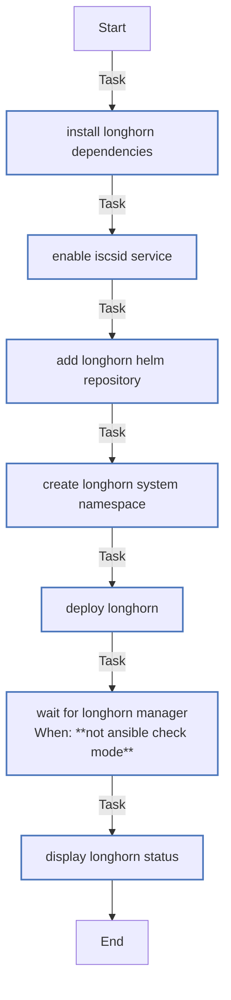

<!-- DOCSIBLE START -->

# 📃 Role overview

## longhorn

Description: Deploy Longhorn distributed storage on K3s

<b> Argument Specifications in meta/argument_specs</b>

#### Key: main

**Description**: Installs Longhorn CSI for replicated persistent volumes.
Configures replicas, data locality, and backup targets.

**Options**:

  - **longhorn_chartVersion**
    - **Required**: True
    - **Type**: str
    - **Default**: none
  
    - **Description**: Longhorn Helm chart version.
  
  
  

  - **longhorn_defaultClass**
    - **Required**: False
    - **Type**: bool
    - **Default**: True
  
    - **Description**: Set Longhorn as default StorageClass.
  
  
  

  - **longhorn_defaultReplicaCount**
    - **Required**: False
    - **Type**: int
    - **Default**: 3
  
    - **Description**: Default number of replicas per volume.
  
  
  

  - **longhorn_dataLocality**
    - **Required**: False
    - **Type**: str
    - **Default**: best-effort
  
    - **Description**: Data locality mode (disabled, best-effort, strict).
  
  
  

  - **longhorn_storageOverProvisioning**
    - **Required**: False
    - **Type**: int
    - **Default**: 200
  
    - **Description**: Storage over-provisioning percentage.
  
  
  

  - **longhorn_storageMinimalAvailable**
    - **Required**: False
    - **Type**: int
    - **Default**: 10
  
    - **Description**: Minimum available storage percentage.
  
  
  

  - **longhorn_backupTarget**
    - **Required**: False
    - **Type**: str
    - **Default**: 
  
    - **Description**: Backup target URL (empty = disabled).
  
  
  

  - **longhorn_backupCredentialSecret**
    - **Required**: False
    - **Type**: str
    - **Default**: 
  
    - **Description**: Secret name for backup credentials.
  
  
  

  - **longhorn_guaranteedEngineManagerCpu**
    - **Required**: False
    - **Type**: int
    - **Default**: 12
  
    - **Description**: Milli-CPU reserved for engine manager.
  
  
  

  - **longhorn_guaranteedReplicaManagerCpu**
    - **Required**: False
    - **Type**: int
    - **Default**: 12
  
    - **Description**: Milli-CPU reserved for replica manager.
  
  
  

  - **longhorn_priorityClass**
    - **Required**: False
    - **Type**: str
    - **Default**: system-node-critical
  
    - **Description**: Priority class for Longhorn components.
  
  
  

### Tasks

#### File: tasks/main.yml

| Name | Module | Has Conditions | Comments |
| ---- | ------ | -------------- | -------- |
| [Install Longhorn dependencies](tasks/main.yml#L5) | ansible.builtin.apt | False | @docsible Install iSCSI and NFS dependencies |
| [Enable iscsid service](tasks/main.yml#L13) | ansible.builtin.systemd | False | @docsible Enable iscsid service for volume attachment |
| [Add Longhorn Helm repository](tasks/main.yml#L20) | kubernetes.core.helm_repository | False | @docsible Add Long Helm repository |
| [Create longhorn-system namespace](tasks/main.yml#L27) | kubernetes.core.k8s | False | @docsible Create dedicated namespace |
| [Deploy Longhorn](tasks/main.yml#L40) | kubernetes.core.helm | False | @docsible Deploy Longhorn with configured replicas and backup |
| [Wait for Longhorn manager](tasks/main.yml#L69) | kubernetes.core.k8s_info | True | @docsible Wait for Longhorn manager DaemonSet readiness |
| [Display Longhorn status](tasks/main.yml#L85) | ansible.builtin.debug | False | @docsible Display deployment status and access info |

## Task Flow Graphs

### Graph for main.yml

## Author Information
rc

### License

MIT

### Minimum Ansible Version

2.14

### Platforms

- **Ubuntu**: ['jammy', 'noble']

### Dependencies

No dependencies specified.
<!-- DOCSIBLE END -->
