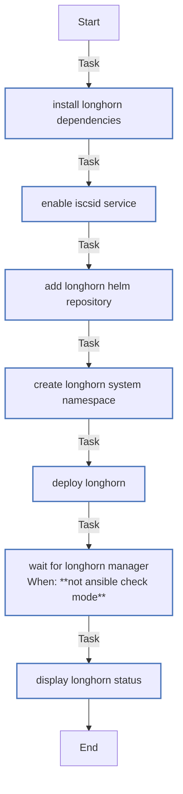

<!-- DOCSIBLE START -->

# 📃 Role overview

## longhorn

Description: Deploy Longhorn distributed storage on K3s

### Tasks

#### File: tasks/main.yml

| Name | Module | Has Conditions | Comments |
| ---- | ------ | -------------- | -------- |
| [Install Longhorn dependencies](tasks/main.yml#L6) | ansible.builtin.apt | False | Install iscsi tools (required by Longhorn) |
| [Enable iscsid service](tasks/main.yml#L14) | ansible.builtin.systemd | False | Enable and start iscsid service |
| [Add Longhorn Helm repository](tasks/main.yml#L21) | kubernetes.core.helm_repository | False | Add Longhorn Helm repository |
| [Create longhorn-system namespace](tasks/main.yml#L28) | kubernetes.core.k8s | False | Create longhorn-system namespace |
| [Deploy Longhorn](tasks/main.yml#L41) | kubernetes.core.helm | False | Deploy Longhorn |
| [Wait for Longhorn manager](tasks/main.yml#L70) | kubernetes.core.k8s_info | True | Wait for Longhorn to be ready |
| [Display Longhorn status](tasks/main.yml#L86) | ansible.builtin.debug | False | Display post-installation info |

## Task Flow Graphs

### Graph for main.yml

## Author Information
rc

### License

MIT

### Minimum Ansible Version

2.14

### Platforms

- **Ubuntu**: ['jammy', 'noble']

### Dependencies

No dependencies specified.
<!-- DOCSIBLE END -->
