<!-- DOCSIBLE START -->

# 📃 Role overview

## miners

Description: Deploy mining workloads (Honeygain, CPU miner, GPU miner) on K3s using Kustomize overlays synchronized to the target node.

<b>🧩 Argument Specifications in meta/argument_specs</b>

#### Key: main

**Description**: Labels eligible nodes for mining and deploys Honeygain/CPU/GPU miner
resources from bootstrap manifests using kubectl kustomize apply.

**Options**:

  - **kubeconfig**
    - **Required**: True
    - **Type**: str
    - **Default**: none
  
    - **Description**: Path to kubeconfig for cluster access.
  
  
  

  - **k8s_manifestsDir**
    - **Required**: True
    - **Type**: str
    - **Default**: none
  
    - **Description**: Remote path where bootstrap manifests are synchronized.
  
  
  

  - **mining_cpuEnabled**
    - **Required**: False
    - **Type**: bool
    - **Default**: False
  
    - **Description**: Enable CPU miner deployment.
  
  
  

  - **mining_gpuEnabled**
    - **Required**: False
    - **Type**: bool
    - **Default**: False
  
    - **Description**: Enable GPU miner deployment.
  
  
  

  - **miners_deployHoneygain**
    - **Required**: False
    - **Type**: bool
    - **Default**: True
  
    - **Description**: Enable Honeygain deployment.
  
  
  

  - **minerLabelNetwork**
    - **Required**: False
    - **Type**: bool
    - **Default**: True
  
    - **Description**: Add network mining eligibility label to control-plane nodes.
  
  
  

  - **miningWallet**
    - **Required**: False
    - **Type**: str
    - **Default**: none
  
    - **Description**: Wallet identifier used by mining secret generation.
  
  
  

  - **honeygainEmail**
    - **Required**: False
    - **Type**: str
    - **Default**: none
  
    - **Description**: Honeygain account email.
  
  
  

  - **honeygainPass**
    - **Required**: False
    - **Type**: str
    - **Default**: none
  
    - **Description**: Honeygain account password.
  
  
  

  - **honeygainDevice**
    - **Required**: False
    - **Type**: str
    - **Default**: bandwidth-miner
  
    - **Description**: Honeygain device name.
  
  
  

  - **nvidia_active**
    - **Required**: False
    - **Type**: bool
    - **Default**: False
  
    - **Description**: Indicates whether NVIDIA stack is active for GPU miner scheduling.
  
  
  

### Defaults

**These are static variables with lower priority**

#### File: defaults/main.yml

| Var          | Type         | Value       |
|--------------|--------------|-------------|
| [miners_deployHoneygain](defaults/main.yml#L1)   | bool | `True` |    

### Tasks

#### File: tasks/main.yml

| Name | Module | Has Conditions | Comments |
| ---- | ------ | -------------- | -------- |
| [Validate mining wallet configuration](tasks/main.yml#L2) | ansible.builtin.assert | True | @docsible Validates mining wallet when CPU or GPU miners are enabled |
| [Build control plane miner labels](tasks/main.yml#L13) | ansible.builtin.set_fact | False | @docsible Builds control-plane labels for miner scheduling |
| [Get control plane nodes for mining labeling](tasks/main.yml#L24) | kubernetes.core.k8s_info | True | @docsible Collects control-plane nodes targeted for miner labels |
| [Label control plane nodes for mining workloads](tasks/main.yml#L36) | kubernetes.core.k8s | True | @docsible Applies miner labels to selected control-plane nodes |
| [Apply miners namespace](tasks/main.yml#L52) | kubernetes.core.k8s | True | @docsible Ensures miners namespace exists before workload deployment |
| [Generate Honeygain config env](tasks/main.yml#L60) | ansible.builtin.copy | True | @docsible Renders Honeygain non-secret env file for Kustomize |
| [Generate Honeygain secret env](tasks/main.yml#L70) | ansible.builtin.copy | True | @docsible Renders Honeygain secret env file for Kustomize |
| [Generate mining wallets env](tasks/main.yml#L80) | ansible.builtin.copy | True | @docsible Renders mining wallet secret env file for Kustomize |
| [Build miner deployment targets](tasks/main.yml#L91) | ansible.builtin.set_fact | False | @docsible Builds enabled Kustomize targets for miner stack deployment |
| [Deploy miner overlays via Kustomize](tasks/main.yml#L111) | ansible.builtin.command | True | @docsible Applies enabled miner overlays via kubectl kustomize |

## Task Flow Graphs

### Graph for main.yml

```mermaid
flowchart TD
Start
classDef block stroke:#3498db,stroke-width:2px;
classDef task stroke:#4b76bb,stroke-width:2px;
classDef includeTasks stroke:#16a085,stroke-width:2px;
classDef importTasks stroke:#34495e,stroke-width:2px;
classDef includeRole stroke:#2980b9,stroke-width:2px;
classDef importRole stroke:#699ba7,stroke-width:2px;
classDef includeVars stroke:#8e44ad,stroke-width:2px;
classDef rescue stroke:#665352,stroke-width:2px;

  Start-->|Task| Validate_mining_wallet_configuration0[validate mining wallet configuration<br>When: **mining cpuenabled   default false    bool  or <br>mining gpuenabled   default false    bool**]:::task
  Validate_mining_wallet_configuration0-->|Task| Build_control_plane_miner_labels1[build control plane miner labels]:::task
  Build_control_plane_miner_labels1-->|Task| Get_control_plane_nodes_for_mining_labeling2[get control plane nodes for mining labeling<br>When: **miner control plane labels   length   0 and not<br>ansible check mode**]:::task
  Get_control_plane_nodes_for_mining_labeling2-->|Task| Label_control_plane_nodes_for_mining_workloads3[label control plane nodes for mining workloads<br>When: **miner control plane labels   length   0 and not<br>ansible check mode**]:::task
  Label_control_plane_nodes_for_mining_workloads3-->|Task| Apply_miners_namespace4[apply miners namespace<br>When: **not ansible check mode**]:::task
  Apply_miners_namespace4-->|Task| Generate_Honeygain_config_env5[generate honeygain config env<br>When: **miners deployhoneygain   default true    bool**]:::task
  Generate_Honeygain_config_env5-->|Task| Generate_Honeygain_secret_env6[generate honeygain secret env<br>When: **miners deployhoneygain   default true    bool**]:::task
  Generate_Honeygain_secret_env6-->|Task| Generate_mining_wallets_env7[generate mining wallets env<br>When: **mining cpuenabled   default false    bool  or <br>mining gpuenabled   default false    bool**]:::task
  Generate_mining_wallets_env7-->|Task| Build_miner_deployment_targets8[build miner deployment targets]:::task
  Build_miner_deployment_targets8-->|Task| Deploy_miner_overlays_via_Kustomize9[deploy miner overlays via kustomize<br>When: **not ansible check mode**]:::task
  Deploy_miner_overlays_via_Kustomize9-->End
```

## Author Information
rc

#### License

MIT

#### Minimum Ansible Version

2.20.0

#### Platforms

- **Ubuntu**: ['noble']

#### Dependencies

No dependencies specified.
<!-- DOCSIBLE END -->
