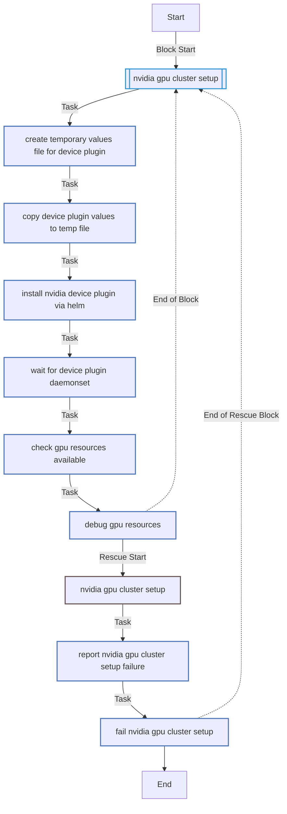

<!-- DOCSIBLE START -->

# 📃 Role overview

## nvidia_gpu

| Field                | Value           |
|--------------------- |-----------------|
| Readme update        | 2026/01/05 |

### Defaults

**These are static variables with lower priority**

#### File: defaults/main.yml

| Var          | Type         | Value       |
|--------------|--------------|-------------|
| [nvidia_gpu_setup](defaults/main.yml#L2)   | str | `auto` |    
| [nvidia_gpu_driver_package](defaults/main.yml#L3)   | str | `auto` |    
| [nvidia_gpu_driver_fallback](defaults/main.yml#L4)   | str | `nvidia-driver-535` |    
| [nvidia_gpu_toolkit_repo_url](defaults/main.yml#L5)   | str | `https://nvidia.github.io/libnvidia-container/stable/deb/nvidia-container-toolkit.list` |    
| [nvidia_gpu_toolkit_gpg_url](defaults/main.yml#L6)   | str | `https://nvidia.github.io/libnvidia-container/gpgkey` |    
| [nvidia_gpu_device_plugin_version](defaults/main.yml#L7)   | str | `0.14.3` |    
| [nvidia_gpu_device_plugin_repo](defaults/main.yml#L8)   | str | `https://nvidia.github.io/k8s-device-plugin` |    
| [nvidia_gpu_reboot_timeout](defaults/main.yml#L9)   | int | `600` |    
| [nvidia_gpu_initramfs_timeout](defaults/main.yml#L10)   | int | `300` |    
| [nvidia_gpu_headless_enabled](defaults/main.yml#L13)   | bool | `True` |    
| [nvidia_gpu_headless_x11_enabled](defaults/main.yml#L14)   | bool | `True` |    
| [nvidia_gpu_pci_bus_id](defaults/main.yml#L15)   | str | `1:0:0` |    
| [nvidia_gpu_coolbits](defaults/main.yml#L16)   | str | `28` |    

### Tasks

#### File: tasks/cluster.yml

| Name | Module | Has Conditions | Tags |
| ---- | ------ | -------------- | -----|
| NVIDIA GPU cluster setup | block | False | cluster,nvidia |
| Create temporary values file for device plugin | ansible.builtin.tempfile | False |  |
| Copy device plugin values to temp file | ansible.builtin.copy | False |  |
| Install NVIDIA device plugin via Helm | kubernetes.core.helm | False |  |
| Wait for device plugin daemonset | ansible.builtin.command | False |  |
| Check GPU resources available | ansible.builtin.shell | False |  |
| Debug GPU resources | ansible.builtin.debug | False |  |

#### File: tasks/headless_optimization.yml

| Name | Module | Has Conditions | Tags |
| ---- | ------ | -------------- | -----|
| NVIDIA GPU headless optimization setup | block | True | nvidia,gpu,nvidia-headless |
| Install X11 packages for headless GPU management | ansible.builtin.apt | False |  |
| Deploy xorg.conf with coolbits for GPU management | ansible.builtin.template | False |  |
| Deploy NVIDIA persistence mode systemd service | ansible.builtin.copy | False |  |
| Deploy NVIDIA X server systemd service | ansible.builtin.copy | False |  |
| Reload systemd daemon | ansible.builtin.systemd | True |  |
| Enable and start NVIDIA persistence mode service | ansible.builtin.systemd | False |  |
| Enable and start NVIDIA X server service | ansible.builtin.systemd | True |  |
| Wait for X server to be ready | ansible.builtin.wait_for | True |  |

#### File: tasks/host.yml

| Name | Module | Has Conditions | Tags | Comments |
| ---- | ------ | -------------- | -----| -------- |
| NVIDIA GPU host setup | block | False | host,nvidia |  |
| Ensure pciutils installed for lspci | ansible.builtin.apt | False |  |  |
| Normalize NVIDIA GPU setup mode | ansible.builtin.set_fact | True |  | Ensure pciutils for GPU detection |
| Get PCI Vendor IDs | ansible.builtin.shell | False |  |  |
| Debug PCI Vendors | ansible.builtin.debug | False |  |  |
| Detect NVIDIA GPU presence | ansible.builtin.set_fact | False |  |  |
| Set GPU Active Fact (Auto) | ansible.builtin.set_fact | True |  |  |
| Set GPU Active Fact (Forced) | ansible.builtin.set_fact | True |  |  |
| Fail if forced but missing | ansible.builtin.fail | True |  |  |
| Set GPU Active Fact (Disabled) | ansible.builtin.set_fact | True |  |  |
| Install driver tools | ansible.builtin.apt | False |  |  |
| Detect NVIDIA driver | ansible.builtin.shell | True |  |  |
| Set detected driver | ansible.builtin.set_fact | True |  |  |
| Set driver fallback | ansible.builtin.set_fact | True |  |  |
| Set manual driver | ansible.builtin.set_fact | True |  |  |
| Blacklist nouveau driver | ansible.builtin.copy | True |  |  |
| Update initramfs if blacklist changed | ansible.builtin.command | True |  |  |
| Calculate nvidia-utils package name | ansible.builtin.set_fact | True |  | Deriva el paquete nvidia-utils del driver detectado (ej: nvidia-driver-535 -> nvidia-utils-535) |
| Check if NVIDIA packages are in broken state | ansible.builtin.shell | True |  |  |
| Force remove broken NVIDIA packages | ansible.builtin.shell | True |  |  |
| Install NVIDIA Driver | ansible.builtin.apt | True |  |  |
| Reboot if driver installed | ansible.builtin.reboot | True |  |  |
| Add Toolkit GPG Key | ansible.builtin.apt_key | True |  |  |
| Add Toolkit Repository | ansible.builtin.get_url | True |  |  |
| Install Toolkit | ansible.builtin.apt | True |  |  |
| Ensure containerd config dir exists | ansible.builtin.file | True |  |  |
| Deploy containerd config template | ansible.builtin.template | True |  |  |

## Task Flow Graphs

### Graph for cluster.yml

### Graph for headless_optimization.yml

```mermaid
flowchart TD
Start
classDef block stroke:#3498db,stroke-width:2px;
classDef task stroke:#4b76bb,stroke-width:2px;
classDef includeTasks stroke:#16a085,stroke-width:2px;
classDef importTasks stroke:#34495e,stroke-width:2px;
classDef includeRole stroke:#2980b9,stroke-width:2px;
classDef importRole stroke:#699ba7,stroke-width:2px;
classDef includeVars stroke:#8e44ad,stroke-width:2px;
classDef rescue stroke:#665352,stroke-width:2px;

  Start-->|Block Start| NVIDIA_GPU_headless_optimization_setup0_block_start_0[[nvidia gpu headless optimization setup<br>When: **nvidia gpu active   default false    bool**]]:::block
  NVIDIA_GPU_headless_optimization_setup0_block_start_0-->|Task| Install_X11_packages_for_headless_GPU_management0[install x11 packages for headless gpu management]:::task
  Install_X11_packages_for_headless_GPU_management0-->|Task| Deploy_xorg_conf_with_coolbits_for_GPU_management1[deploy xorg conf with coolbits for gpu management]:::task
  Deploy_xorg_conf_with_coolbits_for_GPU_management1-->|Task| Deploy_NVIDIA_persistence_mode_systemd_service2[deploy nvidia persistence mode systemd service]:::task
  Deploy_NVIDIA_persistence_mode_systemd_service2-->|Task| Deploy_NVIDIA_X_server_systemd_service3[deploy nvidia x server systemd service]:::task
  Deploy_NVIDIA_X_server_systemd_service3-->|Task| Reload_systemd_daemon4[reload systemd daemon<br>When: **nvidia gpu persistence service changed or nvidia<br>gpu xorg service changed**]:::task
  Reload_systemd_daemon4-->|Task| Enable_and_start_NVIDIA_persistence_mode_service5[enable and start nvidia persistence mode service]:::task
  Enable_and_start_NVIDIA_persistence_mode_service5-->|Task| Enable_and_start_NVIDIA_X_server_service6[enable and start nvidia x server service<br>When: **nvidia gpu headless x11 enabled   default true   <br>bool**]:::task
  Enable_and_start_NVIDIA_X_server_service6-->|Task| Wait_for_X_server_to_be_ready7[wait for x server to be ready<br>When: **nvidia gpu headless x11 enabled   default true   <br>bool**]:::task
  Wait_for_X_server_to_be_ready7-.->|End of Block| NVIDIA_GPU_headless_optimization_setup0_block_start_0
  Wait_for_X_server_to_be_ready7-->|Rescue Start| NVIDIA_GPU_headless_optimization_setup0_rescue_start_0[nvidia gpu headless optimization setup<br>When: **nvidia gpu active   default false    bool**]:::rescue
  NVIDIA_GPU_headless_optimization_setup0_rescue_start_0-->|Task| Report_NVIDIA_GPU_headless_optimization_failure0[report nvidia gpu headless optimization failure]:::task
  Report_NVIDIA_GPU_headless_optimization_failure0-->|Task| Fail_NVIDIA_GPU_headless_optimization1[fail nvidia gpu headless optimization]:::task
  Fail_NVIDIA_GPU_headless_optimization1-.->|End of Rescue Block| NVIDIA_GPU_headless_optimization_setup0_block_start_0
  Fail_NVIDIA_GPU_headless_optimization1-->End
```

### Graph for host.yml

```mermaid
flowchart TD
Start
classDef block stroke:#3498db,stroke-width:2px;
classDef task stroke:#4b76bb,stroke-width:2px;
classDef includeTasks stroke:#16a085,stroke-width:2px;
classDef importTasks stroke:#34495e,stroke-width:2px;
classDef includeRole stroke:#2980b9,stroke-width:2px;
classDef importRole stroke:#699ba7,stroke-width:2px;
classDef includeVars stroke:#8e44ad,stroke-width:2px;
classDef rescue stroke:#665352,stroke-width:2px;

  Start-->|Block Start| NVIDIA_GPU_host_setup0_block_start_0[[nvidia gpu host setup]]:::block
  NVIDIA_GPU_host_setup0_block_start_0-->|Task| Ensure_pciutils_installed_for_lspci0[ensure pciutils installed for lspci]:::task
  Ensure_pciutils_installed_for_lspci0-->|Task| Normalize_NVIDIA_GPU_setup_mode1[normalize nvidia gpu setup mode<br>When: **nvidia gpu setup mode is not defined**]:::task
  Normalize_NVIDIA_GPU_setup_mode1-->|Task| Get_PCI_Vendor_IDs2[get pci vendor ids]:::task
  Get_PCI_Vendor_IDs2-->|Task| Debug_PCI_Vendors3[debug pci vendors]:::task
  Debug_PCI_Vendors3-->|Task| Detect_NVIDIA_GPU_presence4[detect nvidia gpu presence]:::task
  Detect_NVIDIA_GPU_presence4-->|Task| Set_GPU_Active_Fact__Auto_5[set gpu active fact  auto <br>When: **nvidia gpu setup mode     auto**]:::task
  Set_GPU_Active_Fact__Auto_5-->|Task| Set_GPU_Active_Fact__Forced_6[set gpu active fact  forced <br>When: **nvidia gpu setup mode     true**]:::task
  Set_GPU_Active_Fact__Forced_6-->|Task| Fail_if_forced_but_missing7[fail if forced but missing<br>When: **nvidia gpu setup mode     true  and not  nvidia<br>gpu present   default false**]:::task
  Fail_if_forced_but_missing7-->|Task| Set_GPU_Active_Fact__Disabled_8[set gpu active fact  disabled <br>When: **nvidia gpu setup mode     false**]:::task
  Set_GPU_Active_Fact__Disabled_8-->|Task| Install_driver_tools9[install driver tools]:::task
  Install_driver_tools9-->|Task| Detect_NVIDIA_driver10[detect nvidia driver<br>When: **nvidia gpu active   default false    bool and<br>nvidia gpu driver package     auto**]:::task
  Detect_NVIDIA_driver10-->|Task| Set_detected_driver11[set detected driver<br>When: **nvidia gpu active   default false    bool and<br>nvidia gpu driver package     auto  and nvidia gpu<br>detected driver stdout   length   0**]:::task
  Set_detected_driver11-->|Task| Set_driver_fallback12[set driver fallback<br>When: **nvidia gpu driver package     auto  and  nvidia<br>gpu detected driver skipped is defined and nvidia<br>gpu detected driver skipped  or  nvidia gpu<br>detected driver stdout   length    0  and nvidia<br>gpu active   default false    bool**]:::task
  Set_driver_fallback12-->|Task| Set_manual_driver13[set manual driver<br>When: **nvidia gpu active   default false    bool and<br>nvidia gpu driver package     auto**]:::task
  Set_manual_driver13-->|Task| Blacklist_nouveau_driver14[blacklist nouveau driver<br>When: **nvidia gpu active   default false    bool**]:::task
  Blacklist_nouveau_driver14-->|Task| Update_initramfs_if_blacklist_changed15[update initramfs if blacklist changed<br>When: **nvidia gpu blacklist nouveau changed**]:::task
  Update_initramfs_if_blacklist_changed15-->|Task| Calculate_nvidia_utils_package_name16[calculate nvidia utils package name<br>When: **nvidia gpu active   default false    bool**]:::task
  Calculate_nvidia_utils_package_name16-->|Task| Check_if_NVIDIA_packages_are_in_broken_state17[check if nvidia packages are in broken state<br>When: **nvidia gpu active   default false    bool**]:::task
  Check_if_NVIDIA_packages_are_in_broken_state17-->|Task| Force_remove_broken_NVIDIA_packages18[force remove broken nvidia packages<br>When: **nvidia gpu active   default false    bool and<br>nvidia gpu broken check stdout   int   0**]:::task
  Force_remove_broken_NVIDIA_packages18-->|Task| Install_NVIDIA_Driver19[install nvidia driver<br>When: **nvidia gpu active   default false    bool**]:::task
  Install_NVIDIA_Driver19-->|Task| Reboot_if_driver_installed20[reboot if driver installed<br>When: **nvidia gpu driver install changed or nvidia gpu<br>blacklist nouveau changed**]:::task
  Reboot_if_driver_installed20-->|Task| Add_Toolkit_GPG_Key21[add toolkit gpg key<br>When: **nvidia gpu active   default false    bool**]:::task
  Add_Toolkit_GPG_Key21-->|Task| Add_Toolkit_Repository22[add toolkit repository<br>When: **nvidia gpu active   default false    bool**]:::task
  Add_Toolkit_Repository22-->|Task| Install_Toolkit23[install toolkit<br>When: **nvidia gpu active   default false    bool**]:::task
  Install_Toolkit23-->|Task| Ensure_containerd_config_dir_exists24[ensure containerd config dir exists<br>When: **nvidia gpu active   default false    bool**]:::task
  Ensure_containerd_config_dir_exists24-->|Task| Deploy_containerd_config_template25[deploy containerd config template<br>When: **nvidia gpu active   default false    bool**]:::task
  Deploy_containerd_config_template25-.->|End of Block| NVIDIA_GPU_host_setup0_block_start_0
  Deploy_containerd_config_template25-->|Rescue Start| NVIDIA_GPU_host_setup0_rescue_start_0[nvidia gpu host setup]:::rescue
  NVIDIA_GPU_host_setup0_rescue_start_0-->|Task| Report_NVIDIA_GPU_host_setup_failure0[report nvidia gpu host setup failure]:::task
  Report_NVIDIA_GPU_host_setup_failure0-->|Task| Fail_NVIDIA_GPU_host_setup1[fail nvidia gpu host setup]:::task
  Fail_NVIDIA_GPU_host_setup1-.->|End of Rescue Block| NVIDIA_GPU_host_setup0_block_start_0
  Fail_NVIDIA_GPU_host_setup1-->End
```

#### Dependencies

No dependencies specified.
<!-- DOCSIBLE END -->
