<!-- DOCSIBLE START -->

# 📃 Role overview

## nvidia_gpu

Description: Configures NVIDIA GPUs for K3s, including drivers, container toolkit, and device plugin.

<b>🧩 Argument Specifications in meta/argument_specs</b>

#### Key: main

**Description**: Manages NVIDIA drivers, container toolkit, and device plugin installation.
Supports host setup, cluster setup, and headless X11 configurations.

**Options**:

  - **nvidia_gpu_setup**
    - **Required**: False
    - **Type**: str
    - **Default**: auto
  
    - **Description**: Control mode for GPU setup ('auto', 'true', 'false').
  
      - **Choices**:
    
          - auto
    
          - true
    
          - false
    
  
  
  

  - **nvidia_gpu_driver_package**
    - **Required**: False
    - **Type**: str
    - **Default**: auto
  
    - **Description**: Specific driver package to install or "auto" for detection.
  
  
  

  - **nvidia_gpu_driver_fallback**
    - **Required**: False
    - **Type**: str
    - **Default**: nvidia-driver-535
  
    - **Description**: Fallback driver if auto-detection fails.
  
  
  

  - **nvidia_gpu_toolkit_repo_url**
    - **Required**: False
    - **Type**: str
    - **Default**: https://nvidia.github.io/libnvidia-container/stable/deb/nvidia-container-toolkit.list
  
    - **Description**: Repository URL for NVIDIA Container Toolkit.
  
  
  

  - **nvidia_gpu_toolkit_gpg_url**
    - **Required**: False
    - **Type**: str
    - **Default**: https://nvidia.github.io/libnvidia-container/gpgkey
  
    - **Description**: GPG key URL for the toolkit repository.
  
  
  

  - **nvidia_gpu_device_plugin_version**
    - **Required**: False
    - **Type**: str
    - **Default**: none
  
    - **Description**: Version of the NVIDIA device plugin Helm chart.
  
  
  

  - **nvidia_gpu_device_plugin_repo**
    - **Required**: False
    - **Type**: str
    - **Default**: https://nvidia.github.io/k8s-device-plugin
  
    - **Description**: Helm repository for the device plugin.
  
  
  

  - **nvidia_gpu_reboot_timeout**
    - **Required**: False
    - **Type**: int
    - **Default**: 600
  
    - **Description**: Timeout (seconds) for rebooting after driver installation.
  
  
  

  - **nvidia_gpu_headless_x11_enabled**
    - **Required**: False
    - **Type**: bool
    - **Default**: True
  
    - **Description**: Enables X11 services for headless GPU management (fan control, etc.).
  
  
  

  - **nvidia_gpu_pci_bus_id**
    - **Required**: False
    - **Type**: str
    - **Default**: 1:0:0
  
    - **Description**: PCI Bus ID of the GPU for xorg.conf generation.
  
  
  

  - **nvidia_gpu_coolbits**
    - **Required**: False
    - **Type**: str
    - **Default**: 28
  
    - **Description**: Coolbits value for unlocking GPU control (fans, clocks).
  
  
  

### Defaults

**These are static variables with lower priority**

#### File: defaults/main.yml

| Var          | Type         | Value       |Required    | Title       |
|--------------|--------------|-------------|------------|-------------|
| [nvidia_gpu_setup](defaults/main.yml#L5)   | str | `auto` |    false  |  GPU Setup Mode |
| [nvidia_gpu_driver_package](defaults/main.yml#L10)   | str | `auto` |    false  |  Driver Package |
| [nvidia_gpu_driver_fallback](defaults/main.yml#L15)   | str | `nvidia-driver-535` |    false  |  Fallback Driver |
| [nvidia_gpu_toolkit_repo_url](defaults/main.yml#L20)   | str | `https://nvidia.github.io/libnvidia-container/stable/deb/nvidia-container-toolkit.list` |    false  |  Toolkit Repo URL |
| [nvidia_gpu_toolkit_gpg_url](defaults/main.yml#L25)   | str | `https://nvidia.github.io/libnvidia-container/gpgkey` |    false  |  Toolkit GPG Key |
| [nvidia_gpu_device_plugin_version](defaults/main.yml#L30)   | str | `0.14.3` |    false  |  Device Plugin Version |
| [nvidia_gpu_device_plugin_repo](defaults/main.yml#L35)   | str | `https://nvidia.github.io/k8s-device-plugin` |    false  |  Device Plugin Repo |
| [nvidia_gpu_reboot_timeout](defaults/main.yml#L40)   | int | `600` |    false  |  Reboot Timeout |
| [nvidia_gpu_headless_x11_enabled](defaults/main.yml#L45)   | bool | `True` |    false  |  Headless X11 |
| [nvidia_gpu_pci_bus_id](defaults/main.yml#L50)   | str | `1:0:0` |    false  |  PCI Bus ID |
| [nvidia_gpu_coolbits](defaults/main.yml#L55)   | str | `28` |    false  |  Coolbits |

<b>🖇️ Full descriptions for vars in defaults/main.yml</b>

 
<table>
<th>Var</th><th>Description</th>
<tr><td><b>nvidia_gpu_setup</b></td><td>Control mode for GPU setup ('auto', 'true', 'false').</td></tr>
<tr><td><b>nvidia_gpu_driver_package</b></td><td>Specific driver package to install or "auto" for detection.</td></tr>
<tr><td><b>nvidia_gpu_driver_fallback</b></td><td>Fallback driver if auto-detection fails.</td></tr>
<tr><td><b>nvidia_gpu_toolkit_repo_url</b></td><td>Repository URL for NVIDIA Container Toolkit.</td></tr>
<tr><td><b>nvidia_gpu_toolkit_gpg_url</b></td><td>GPG key URL for the toolkit repository.</td></tr>
<tr><td><b>nvidia_gpu_device_plugin_version</b></td><td>Version of the NVIDIA device plugin Helm chart.</td></tr>
<tr><td><b>nvidia_gpu_device_plugin_repo</b></td><td>Helm repository for the device plugin.</td></tr>
<tr><td><b>nvidia_gpu_reboot_timeout</b></td><td>Timeout (seconds) for rebooting after driver installation.</td></tr>
<tr><td><b>nvidia_gpu_headless_x11_enabled</b></td><td>Enables X11 services for headless GPU management (fan control, etc.).</td></tr>
<tr><td><b>nvidia_gpu_pci_bus_id</b></td><td>PCI Bus ID of the GPU for xorg.conf generation.</td></tr>
<tr><td><b>nvidia_gpu_coolbits</b></td><td>Coolbits value for unlocking GPU control (fans, clocks).</td></tr>
</table>
 

### Tasks

#### File: tasks/cluster.yml

| Name | Module | Has Conditions | Tags |
| ---- | ------ | -------------- | -----|
| [NVIDIA GPU cluster setup](tasks/cluster.yml#L1) | block | True | cluster,nvidia |
| [Check if Helm is installed](tasks/cluster.yml#L4) | ansible.builtin.command | False |  |
| [Warn if Helm is not available](tasks/cluster.yml#L10) | ansible.builtin.debug | True |  |
| [Ensure NVIDIA Helm repo](tasks/cluster.yml#L15) | kubernetes.core.helm_repository | True |  |
| [Create temp values](tasks/cluster.yml#L21) | ansible.builtin.tempfile | True |  |
| [Copy values](tasks/cluster.yml#L28) | ansible.builtin.copy | True |  |
| [Install device plugin](tasks/cluster.yml#L35) | kubernetes.core.helm | True |  |
| [Wait for daemonset](tasks/cluster.yml#L47) | ansible.builtin.command | True |  |
| [Check GPU resources](tasks/cluster.yml#L56) | ansible.builtin.shell | True |  |
| [Debug GPU resources](tasks/cluster.yml#L66) | ansible.builtin.debug | True |  |

#### File: tasks/headless_optimization.yml

| Name | Module | Has Conditions |
| ---- | ------ | -------------- |
| [Install X11 deps](tasks/headless_optimization.yml#L1) | ansible.builtin.apt | True |
| [Configure xorg](tasks/headless_optimization.yml#L11) | ansible.builtin.template | True |
| [Deploy persistence svc](tasks/headless_optimization.yml#L21) | ansible.builtin.copy | True |
| [Deploy Xorg svc](tasks/headless_optimization.yml#L31) | ansible.builtin.copy | True |
| [Reload systemd (nvidia)](tasks/headless_optimization.yml#L41) | ansible.builtin.systemd | True |
| [Start persistence svc](tasks/headless_optimization.yml#L48) | ansible.builtin.systemd | True |
| [Start Xorg svc](tasks/headless_optimization.yml#L55) | ansible.builtin.systemd | True |
| [Wait for X server](tasks/headless_optimization.yml#L64) | ansible.builtin.wait_for | True |

#### File: tasks/host.yml

| Name | Module | Has Conditions | Tags |
| ---- | ------ | -------------- | -----|
| [Install pciutils](tasks/host.yml#L1) | ansible.builtin.apt | False |  |
| [Normalize setup mode](tasks/host.yml#L8) | ansible.builtin.set_fact | False |  |
| [Get PCI vendors](tasks/host.yml#L12) | ansible.builtin.shell | False |  |
| [Detect GPU](tasks/host.yml#L17) | ansible.builtin.set_fact | False |  |
| [Set GPU active (auto)](tasks/host.yml#L30) | ansible.builtin.set_fact | True |  |
| [Set GPU active (forced)](tasks/host.yml#L36) | ansible.builtin.set_fact | True |  |
| [Fail if GPU missing](tasks/host.yml#L42) | ansible.builtin.fail | True |  |
| [Set GPU active (disabled)](tasks/host.yml#L49) | ansible.builtin.set_fact | True |  |
| [Debug NVIDIA facts](tasks/host.yml#L55) | ansible.builtin.debug | False |  |
| [Install driver deps](tasks/host.yml#L59) | ansible.builtin.apt | True |  |
| [Detect driver](tasks/host.yml#L69) | ansible.builtin.shell | True |  |
| [Set driver version](tasks/host.yml#L81) | ansible.builtin.set_fact | True |  |
| [Set driver fallback](tasks/host.yml#L89) | ansible.builtin.set_fact | True |  |
| [Set manual driver](tasks/host.yml#L98) | ansible.builtin.set_fact | True |  |
| [Blacklist nouveau](tasks/host.yml#L105) | ansible.builtin.copy | True |  |
| [Update initramfs](tasks/host.yml#L115) | ansible.builtin.command | True |  |
| [Set utils package](tasks/host.yml#L122) | ansible.builtin.set_fact | True |  |
| [Check broken packages](tasks/host.yml#L127) | ansible.builtin.shell | True |  |
| [Fix broken packages](tasks/host.yml#L133) | ansible.builtin.shell | True |  |
| [Install NVIDIA driver](tasks/host.yml#L146) | ansible.builtin.apt | True |  |
| [Reboot system (nvidia)](tasks/host.yml#L156) | ansible.builtin.reboot | True |  |
| [Ensure APT keyrings dir](tasks/host.yml#L165) | ansible.builtin.file | True |  |
| [Write toolkit repo](tasks/host.yml#L172) | ansible.builtin.copy | True |  |
| [Install toolkit](tasks/host.yml#L184) | ansible.builtin.apt | True |  |
| [Register NVIDIA as an available runtime](tasks/host.yml#L192) | ansible.builtin.set_fact | True | host,nvidia |
| [Import headless optimization](tasks/host.yml#L198) | ansible.builtin.import_tasks | True |  |

## Task Flow Graphs

### Graph for cluster.yml

```mermaid
flowchart TD
Start
classDef block stroke:#3498db,stroke-width:2px;
classDef task stroke:#4b76bb,stroke-width:2px;
classDef includeTasks stroke:#16a085,stroke-width:2px;
classDef importTasks stroke:#34495e,stroke-width:2px;
classDef includeRole stroke:#2980b9,stroke-width:2px;
classDef importRole stroke:#699ba7,stroke-width:2px;
classDef includeVars stroke:#8e44ad,stroke-width:2px;
classDef rescue stroke:#665352,stroke-width:2px;

  Start-->|Block Start| NVIDIA_GPU_cluster_setup0_block_start_0[[nvidia gpu cluster setup<br>When: **not ansible check mode**]]:::block
  NVIDIA_GPU_cluster_setup0_block_start_0-->|Task| Check_if_Helm_is_installed0[check if helm is installed]:::task
  Check_if_Helm_is_installed0-->|Task| Warn_if_Helm_is_not_available1[warn if helm is not available<br>When: **helm binary check rc    0**]:::task
  Warn_if_Helm_is_not_available1-->|Task| Ensure_NVIDIA_Helm_repo2[ensure nvidia helm repo<br>When: **helm binary check rc    0**]:::task
  Ensure_NVIDIA_Helm_repo2-->|Task| Create_temp_values3[create temp values<br>When: **helm binary check rc    0**]:::task
  Create_temp_values3-->|Task| Copy_values4[copy values<br>When: **helm binary check rc    0**]:::task
  Copy_values4-->|Task| Install_device_plugin5[install device plugin<br>When: **helm binary check rc    0**]:::task
  Install_device_plugin5-->|Task| Wait_for_daemonset6[wait for daemonset<br>When: **helm binary check rc    0**]:::task
  Wait_for_daemonset6-->|Task| Check_GPU_resources7[check gpu resources<br>When: **helm binary check rc    0**]:::task
  Check_GPU_resources7-->|Task| Debug_GPU_resources8[debug gpu resources<br>When: **helm binary check rc    0**]:::task
  Debug_GPU_resources8-.->|End of Block| NVIDIA_GPU_cluster_setup0_block_start_0
  Debug_GPU_resources8-->|Rescue Start| NVIDIA_GPU_cluster_setup0_rescue_start_0[nvidia gpu cluster setup<br>When: **not ansible check mode**]:::rescue
  NVIDIA_GPU_cluster_setup0_rescue_start_0-->|Task| Report_NVIDIA_GPU_cluster_setup_failure0[report nvidia gpu cluster setup failure]:::task
  Report_NVIDIA_GPU_cluster_setup_failure0-->|Task| Fail_NVIDIA_GPU_cluster_setup1[fail nvidia gpu cluster setup]:::task
  Fail_NVIDIA_GPU_cluster_setup1-.->|End of Rescue Block| NVIDIA_GPU_cluster_setup0_block_start_0
  Fail_NVIDIA_GPU_cluster_setup1-->End
```

### Graph for headless_optimization.yml

```mermaid
flowchart TD
Start
classDef block stroke:#3498db,stroke-width:2px;
classDef task stroke:#4b76bb,stroke-width:2px;
classDef includeTasks stroke:#16a085,stroke-width:2px;
classDef importTasks stroke:#34495e,stroke-width:2px;
classDef includeRole stroke:#2980b9,stroke-width:2px;
classDef importRole stroke:#699ba7,stroke-width:2px;
classDef includeVars stroke:#8e44ad,stroke-width:2px;
classDef rescue stroke:#665352,stroke-width:2px;

  Start-->|Task| Install_X11_deps0[install x11 deps<br>When: **nvidia gpu active   default false    bool**]:::task
  Install_X11_deps0-->|Task| Configure_xorg1[configure xorg<br>When: **nvidia gpu active   default false    bool**]:::task
  Configure_xorg1-->|Task| Deploy_persistence_svc2[deploy persistence svc<br>When: **nvidia gpu active   default false    bool**]:::task
  Deploy_persistence_svc2-->|Task| Deploy_Xorg_svc3[deploy xorg svc<br>When: **nvidia gpu active   default false    bool**]:::task
  Deploy_Xorg_svc3-->|Task| Reload_systemd__nvidia_4[reload systemd  nvidia <br>When: **nvidia gpu active   default false    bool and<br>nvidia gpu persistence service changed or nvidia<br>gpu xorg service changed**]:::task
  Reload_systemd__nvidia_4-->|Task| Start_persistence_svc5[start persistence svc<br>When: **nvidia gpu active   default false    bool**]:::task
  Start_persistence_svc5-->|Task| Start_Xorg_svc6[start xorg svc<br>When: **nvidia gpu active   default false    bool and<br>nvidia gpu headless x11 enabled   default true   <br>bool**]:::task
  Start_Xorg_svc6-->|Task| Wait_for_X_server7[wait for x server<br>When: **nvidia gpu active   default false    bool and<br>nvidia gpu headless x11 enabled   default true   <br>bool**]:::task
  Wait_for_X_server7-->End
```

### Graph for host.yml

```mermaid
flowchart TD
Start
classDef block stroke:#3498db,stroke-width:2px;
classDef task stroke:#4b76bb,stroke-width:2px;
classDef includeTasks stroke:#16a085,stroke-width:2px;
classDef importTasks stroke:#34495e,stroke-width:2px;
classDef includeRole stroke:#2980b9,stroke-width:2px;
classDef importRole stroke:#699ba7,stroke-width:2px;
classDef includeVars stroke:#8e44ad,stroke-width:2px;
classDef rescue stroke:#665352,stroke-width:2px;

  Start-->|Task| Install_pciutils0[install pciutils]:::task
  Install_pciutils0-->|Task| Normalize_setup_mode1[normalize setup mode]:::task
  Normalize_setup_mode1-->|Task| Get_PCI_vendors2[get pci vendors]:::task
  Get_PCI_vendors2-->|Task| Detect_GPU3[detect gpu]:::task
  Detect_GPU3-->|Task| Set_GPU_active__auto_4[set gpu active  auto <br>When: **nvidia gpu setup mode     auto**]:::task
  Set_GPU_active__auto_4-->|Task| Set_GPU_active__forced_5[set gpu active  forced <br>When: **nvidia gpu setup mode     true**]:::task
  Set_GPU_active__forced_5-->|Task| Fail_if_GPU_missing6[fail if gpu missing<br>When: **nvidia gpu setup mode     true  and not  nvidia<br>gpu present   default false**]:::task
  Fail_if_GPU_missing6-->|Task| Set_GPU_active__disabled_7[set gpu active  disabled <br>When: **nvidia gpu setup mode     false**]:::task
  Set_GPU_active__disabled_7-->|Task| Debug_NVIDIA_facts8[debug nvidia facts]:::task
  Debug_NVIDIA_facts8-->|Task| Install_driver_deps9[install driver deps<br>When: **nvidia gpu active   default false    bool**]:::task
  Install_driver_deps9-->|Task| Detect_driver10[detect driver<br>When: **nvidia gpu active   default false    bool and<br>nvidia gpu driver package     auto**]:::task
  Detect_driver10-->|Task| Set_driver_version11[set driver version<br>When: **nvidia gpu active   default false    bool and<br>nvidia gpu driver package     auto  and nvidia gpu<br>detected driver stdout   length   0**]:::task
  Set_driver_version11-->|Task| Set_driver_fallback12[set driver fallback<br>When: **nvidia gpu driver package     auto  and  nvidia<br>gpu detected driver skipped is defined and nvidia<br>gpu detected driver skipped  or  nvidia gpu<br>detected driver stdout   length    0  and nvidia<br>gpu active   default false    bool**]:::task
  Set_driver_fallback12-->|Task| Set_manual_driver13[set manual driver<br>When: **nvidia gpu active   default false    bool and<br>nvidia gpu driver package     auto**]:::task
  Set_manual_driver13-->|Task| Blacklist_nouveau14[blacklist nouveau<br>When: **nvidia gpu active   default false    bool**]:::task
  Blacklist_nouveau14-->|Task| Update_initramfs15[update initramfs<br>When: **nvidia gpu blacklist nouveau changed and not<br>ansible check mode**]:::task
  Update_initramfs15-->|Task| Set_utils_package16[set utils package<br>When: **nvidia gpu active   default false    bool**]:::task
  Set_utils_package16-->|Task| Check_broken_packages17[check broken packages<br>When: **nvidia gpu active   default false    bool**]:::task
  Check_broken_packages17-->|Task| Fix_broken_packages18[fix broken packages<br>When: **nvidia gpu active   default false    bool and<br>nvidia gpu broken check stdout   int   0 and not<br>ansible check mode**]:::task
  Fix_broken_packages18-->|Task| Install_NVIDIA_driver19[install nvidia driver<br>When: **nvidia gpu active   default false    bool**]:::task
  Install_NVIDIA_driver19-->|Task| Reboot_system__nvidia_20[reboot system  nvidia <br>When: **nvidia gpu active   default false    bool and<br>nvidia gpu driver install changed or nvidia gpu<br>blacklist nouveau changed and not ansible check<br>mode**]:::task
  Reboot_system__nvidia_20-->|Task| Ensure_APT_keyrings_dir21[ensure apt keyrings dir<br>When: **nvidia gpu active   default false    bool**]:::task
  Ensure_APT_keyrings_dir21-->|Task| Write_toolkit_repo22[write toolkit repo<br>When: **nvidia gpu active   default false    bool**]:::task
  Write_toolkit_repo22-->|Task| Install_toolkit23[install toolkit<br>When: **nvidia gpu active   default false    bool**]:::task
  Install_toolkit23-->|Task| Register_NVIDIA_as_an_available_runtime24[register nvidia as an available runtime<br>When: **nvidia gpu active   default false    bool**]:::task
  Register_NVIDIA_as_an_available_runtime24-->|Import task| Import_headless_optimization_headless_optimization_yml_25[/import headless optimization<br>When: **nvidia gpu active   default false    bool and<br>nvidia gpu headless x11 enabled   default true   <br>bool**<br>import_task: headless optimization yml/]:::importTasks
  Import_headless_optimization_headless_optimization_yml_25-->End
```

## Author Information
Roura

#### License

MIT

#### Minimum Ansible Version

2.20.0

#### Platforms

- **Ubuntu**: ['noble']

#### Dependencies

No dependencies specified.
<!-- DOCSIBLE END -->
