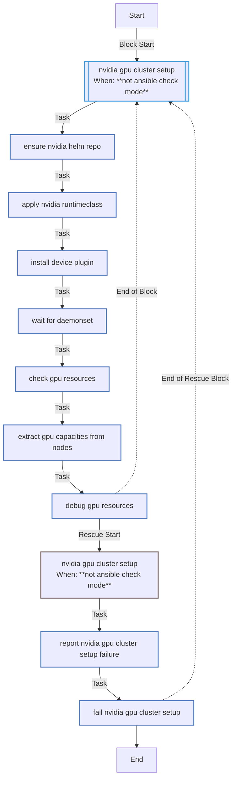

<!-- DOCSIBLE START -->

# 📃 Role overview

## nvidia_gpu

Description: Configures NVIDIA GPUs for K3s, including drivers, container toolkit, and device plugin.

<b> Argument Specifications in meta/argument_specs</b>

#### Key: main

**Description**: Manages NVIDIA drivers, container toolkit, and device plugin installation.
Supports host setup, cluster setup, and headless X11 configurations.

**Options**:

  - **nvidia_setup**
    - **Required**: False
    - **Type**: str
    - **Default**: auto
  
    - **Description**: Control mode for GPU setup ('auto', 'true', 'false').
  
      - **Choices**:
    
          - auto
    
          - true
    
          - false
    
  
  
  

  - **nvidia_driverPackage**
    - **Required**: False
    - **Type**: str
    - **Default**: auto
  
    - **Description**: Specific driver package to install or "auto" for detection.
  
  
  

  - **nvidia_driverFallback**
    - **Required**: False
    - **Type**: str
    - **Default**: nvidia-driver-535
  
    - **Description**: Fallback driver if auto-detection fails.
  
  
  

  - **nvidia_toolkitRepoUrl**
    - **Required**: False
    - **Type**: str
    - **Default**: https://nvidia.github.io/libnvidia-container/stable/deb/nvidia-container-toolkit.list
  
    - **Description**: Repository URL for NVIDIA Container Toolkit.
  
  
  

  - **nvidia_toolkitGpgUrl**
    - **Required**: False
    - **Type**: str
    - **Default**: https://nvidia.github.io/libnvidia-container/gpgkey
  
    - **Description**: GPG key URL for the toolkit repository.
  
  
  

  - **nvidia_devicePluginVersion**
    - **Required**: False
    - **Type**: str
    - **Default**: none
  
    - **Description**: Version of the NVIDIA device plugin Helm chart.
  
  
  

  - **nvidia_devicePluginRepo**
    - **Required**: False
    - **Type**: str
    - **Default**: https://nvidia.github.io/k8s-device-plugin
  
    - **Description**: Helm repository for the device plugin.
  
  
  

  - **nvidia_rebootTimeout**
    - **Required**: False
    - **Type**: int
    - **Default**: 600
  
    - **Description**: Timeout (seconds) for rebooting after driver installation.
  
  
  

  - **nvidia_headlessX11Enabled**
    - **Required**: False
    - **Type**: bool
    - **Default**: True
  
    - **Description**: Enables X11 services for headless GPU management (fan control, etc.).
  
  
  

  - **nvidia_pciBusId**
    - **Required**: False
    - **Type**: str
    - **Default**: 1:0:0
  
    - **Description**: PCI Bus ID of the GPU for xorg.conf generation.
  
  
  

  - **nvidia_coolbits**
    - **Required**: False
    - **Type**: str
    - **Default**: 28
  
    - **Description**: Coolbits value for unlocking GPU control (fans, clocks).
  
  
  

### Tasks

#### File: tasks/cluster.yml

| Name | Module | Has Conditions | Tags | Comments |
| ---- | ------ | -------------- | -----| -------- |
| [NVIDIA GPU cluster setup](tasks/cluster.yml#L2) | block | True | cluster,nvidia | @docsible Block: NVIDIA GPU Cluster Integration |
| [Ensure NVIDIA Helm repo](tasks/cluster.yml#L6) | kubernetes.core.helm_repository | False |  | @docsible Registers NVIDIA Device Plugin Helm Repo |
| [Apply NVIDIA RuntimeClass](tasks/cluster.yml#L12) | kubernetes.core.k8s | False |  | @docsible Registers 'nvidia' RuntimeClass |
| [Install device plugin](tasks/cluster.yml#L19) | kubernetes.core.helm | False |  | @docsible Installs NVIDIA Device Plugin (Helm) |
| [Wait for daemonset](tasks/cluster.yml#L31) | kubernetes.core.k8s_info | False |  | @docsible Waits for Device Plugin DaemonSet |
| [Check GPU resources](tasks/cluster.yml#L46) | kubernetes.core.k8s_info | False |  | @docsible Queries Node status for GPU capacity |
| [Extract GPU capacities from nodes](tasks/cluster.yml#L54) | ansible.builtin.set_fact | False |  | @docsible Parses GPU capacity from Node status |
| [Debug GPU resources](tasks/cluster.yml#L63) | ansible.builtin.debug | False |  | @docsible Displays detected GPU count |

#### File: tasks/headless_optimization.yml

| Name | Module | Has Conditions | Comments |
| ---- | ------ | -------------- | -------- |
| [Install X11 deps](tasks/headless_optimization.yml#L2) | ansible.builtin.apt | True | @docsible Installs Xorg for headless fan control |
| [Configure xorg](tasks/headless_optimization.yml#L13) | ansible.builtin.template | True | @docsible Configures Xorg with Coolbits (Fan Control) |
| [Deploy persistence svc](tasks/headless_optimization.yml#L24) | ansible.builtin.copy | True | @docsible Deploys nvidia-persistenced service |
| [Deploy Xorg svc](tasks/headless_optimization.yml#L35) | ansible.builtin.copy | True | @docsible Deploys Headless Xorg service |
| [Reload systemd (nvidia)](tasks/headless_optimization.yml#L46) | ansible.builtin.systemd | True | @docsible Reloads systemd daemon |
| [Start persistence svc](tasks/headless_optimization.yml#L54) | ansible.builtin.systemd | True | @docsible Starts nvidia-persistenced |
| [Start Xorg svc](tasks/headless_optimization.yml#L62) | ansible.builtin.systemd | True | @docsible Starts Headless Xorg on Display :1 |
| [Wait for X server](tasks/headless_optimization.yml#L72) | ansible.builtin.wait_for | True | @docsible Waits for X11 socket availability |

#### File: tasks/host.yml

| Name | Module | Has Conditions | Tags | Comments |
| ---- | ------ | -------------- | -----| -------- |
| [Install pciutils](tasks/host.yml#L2) | ansible.builtin.apt | False |  | @docsible Installs pciutils to detect hardware IDs |
| [Normalize setup mode](tasks/host.yml#L10) | ansible.builtin.set_fact | False |  | @docsible Normalizes nvidia_setupMode fact |
| [Get PCI vendors](tasks/host.yml#L15) | ansible.builtin.shell | False |  | @docsible Scans PCI bus for vendor IDs |
| [Detect GPU](tasks/host.yml#L21) | ansible.builtin.set_fact | False |  | @docsible Detects NVIDIA GPU (Vendor ID 0x10de) |
| [Set GPU active (auto)](tasks/host.yml#L35) | ansible.builtin.set_fact | True |  | @docsible Activates NVIDIA setup if GPU found (Auto Mode) |
| [Set GPU active (forced)](tasks/host.yml#L42) | ansible.builtin.set_fact | True |  | @docsible Forces NVIDIA setup enabled |
| [Fail if GPU missing](tasks/host.yml#L49) | ansible.builtin.fail | True |  | @docsible Fails if GPU missing when forced |
| [Set GPU active (disabled)](tasks/host.yml#L57) | ansible.builtin.set_fact | True |  | @docsible Disables NVIDIA setup explicitly |
| [Debug NVIDIA facts](tasks/host.yml#L64) | ansible.builtin.debug | False |  | @docsible Debugs NVIDIA detection state |
| [Install driver deps](tasks/host.yml#L69) | ansible.builtin.apt | True |  | @docsible Installs kernel headers and driver dependencies |
| [Detect driver](tasks/host.yml#L80) | ansible.builtin.shell | True |  | @docsible Queries ubuntu-drivers for recommended version |
| [Set driver version](tasks/host.yml#L93) | ansible.builtin.set_fact | True |  | @docsible Sets target driver version from auto-detection |
| [Set driver fallback](tasks/host.yml#L102) | ansible.builtin.set_fact | True |  | @docsible Sets fallback driver version if detection fails |
| [Set manual driver](tasks/host.yml#L112) | ansible.builtin.set_fact | True |  | @docsible Sets manual driver version override |
| [Blacklist nouveau](tasks/host.yml#L120) | ansible.builtin.copy | True |  | @docsible Blacklists open-source Nouveau driver |
| [Update initramfs](tasks/host.yml#L131) | ansible.builtin.command | True |  | @docsible Regenerates initramfs after Nouveau blacklist changes |
| [Set utils package](tasks/host.yml#L139) | ansible.builtin.set_fact | True |  | @docsible Resolves nvidia-utils package name |
| [Check broken packages](tasks/host.yml#L145) | ansible.builtin.shell | True |  | @docsible Checks for partially installed (broken) packages |
| [Fix broken packages](tasks/host.yml#L152) | ansible.builtin.shell | True |  | @docsible Purges broken NVIDIA packages to allow clean install |
| [Install NVIDIA driver](tasks/host.yml#L166) | ansible.builtin.apt | True |  | @docsible Installs NVIDIA Driver and Utils |
| [Reboot system (nvidia)](tasks/host.yml#L177) | ansible.builtin.reboot | True |  | @docsible Reboots system to load new kernel modules |
| [Ensure APT keyrings dir](tasks/host.yml#L187) | ansible.builtin.file | True |  | @docsible Creates APT keyrings directory |
| [Write toolkit repo](tasks/host.yml#L197) | ansible.builtin.copy | True |  | @docsible Adds NVIDIA Container Toolkit repository |
| [Install toolkit](tasks/host.yml#L210) | ansible.builtin.apt | True |  | @docsible Installs NVIDIA Container Toolkit |
| [Ensure CDI directory exists](tasks/host.yml#L220) | ansible.builtin.file | True |  | @docsible Creates CDI directory |
| [Check NVIDIA driver status](tasks/host.yml#L230) | ansible.builtin.command | True |  | @docsible Verifies nvidia-smi functionality |
| [Reboot to fix driver mismatch](tasks/host.yml#L240) | ansible.builtin.reboot | True |  | @docsible Reboots if driver version mismatch detected |
| [Generate NVIDIA CDI specification](tasks/host.yml#L250) | ansible.builtin.command | True |  | @docsible Generates CDI specification |
| [Register NVIDIA as an available runtime](tasks/host.yml#L258) | ansible.builtin.set_fact | True | host,nvidia | @docsible Registers 'nvidia' runtime for Containerd |
| [Update runtime list with NVIDIA](tasks/host.yml#L265) | ansible.builtin.set_fact | True | host,nvidia | @docsible Adds NVIDIA runtime to k3s_commonContainerdAdditionalRuntimes |
| [Import headless optimization](tasks/host.yml#L273) | ansible.builtin.import_tasks | True |  | @docsible Imports Headless X11 configuration tasks |

## Task Flow Graphs

### Graph for cluster.yml

### Graph for headless_optimization.yml

```mermaid
flowchart TD
Start
classDef block stroke:#3498db,stroke-width:2px;
classDef task stroke:#4b76bb,stroke-width:2px;
classDef includeTasks stroke:#16a085,stroke-width:2px;
classDef importTasks stroke:#34495e,stroke-width:2px;
classDef includeRole stroke:#2980b9,stroke-width:2px;
classDef importRole stroke:#699ba7,stroke-width:2px;
classDef includeVars stroke:#8e44ad,stroke-width:2px;
classDef rescue stroke:#665352,stroke-width:2px;

  Start-->|Task| Install_X11_deps0[install x11 deps<br>When: **nvidia active   default false    bool**]:::task
  Install_X11_deps0-->|Task| Configure_xorg1[configure xorg<br>When: **nvidia active   default false    bool**]:::task
  Configure_xorg1-->|Task| Deploy_persistence_svc2[deploy persistence svc<br>When: **nvidia active   default false    bool**]:::task
  Deploy_persistence_svc2-->|Task| Deploy_Xorg_svc3[deploy xorg svc<br>When: **nvidia active   default false    bool**]:::task
  Deploy_Xorg_svc3-->|Task| Reload_systemd__nvidia_4[reload systemd  nvidia <br>When: **nvidia active   default false    bool and nvidia<br>persistenceservice changed or nvidia xorgservice<br>changed**]:::task
  Reload_systemd__nvidia_4-->|Task| Start_persistence_svc5[start persistence svc<br>When: **nvidia active   default false    bool**]:::task
  Start_persistence_svc5-->|Task| Start_Xorg_svc6[start xorg svc<br>When: **nvidia active   default false    bool and nvidia<br>headlessx11enabled   default true    bool**]:::task
  Start_Xorg_svc6-->|Task| Wait_for_X_server7[wait for x server<br>When: **nvidia active   default false    bool and nvidia<br>headlessx11enabled   default true    bool**]:::task
  Wait_for_X_server7-->End
```

### Graph for host.yml

```mermaid
flowchart TD
Start
classDef block stroke:#3498db,stroke-width:2px;
classDef task stroke:#4b76bb,stroke-width:2px;
classDef includeTasks stroke:#16a085,stroke-width:2px;
classDef importTasks stroke:#34495e,stroke-width:2px;
classDef includeRole stroke:#2980b9,stroke-width:2px;
classDef importRole stroke:#699ba7,stroke-width:2px;
classDef includeVars stroke:#8e44ad,stroke-width:2px;
classDef rescue stroke:#665352,stroke-width:2px;

  Start-->|Task| Install_pciutils0[install pciutils]:::task
  Install_pciutils0-->|Task| Normalize_setup_mode1[normalize setup mode]:::task
  Normalize_setup_mode1-->|Task| Get_PCI_vendors2[get pci vendors]:::task
  Get_PCI_vendors2-->|Task| Detect_GPU3[detect gpu]:::task
  Detect_GPU3-->|Task| Set_GPU_active__auto_4[set gpu active  auto <br>When: **nvidia setupmode     auto**]:::task
  Set_GPU_active__auto_4-->|Task| Set_GPU_active__forced_5[set gpu active  forced <br>When: **nvidia setupmode     true**]:::task
  Set_GPU_active__forced_5-->|Task| Fail_if_GPU_missing6[fail if gpu missing<br>When: **nvidia setupmode     true  and not  nvidia present<br>  default false**]:::task
  Fail_if_GPU_missing6-->|Task| Set_GPU_active__disabled_7[set gpu active  disabled <br>When: **nvidia setupmode     false**]:::task
  Set_GPU_active__disabled_7-->|Task| Debug_NVIDIA_facts8[debug nvidia facts]:::task
  Debug_NVIDIA_facts8-->|Task| Install_driver_deps9[install driver deps<br>When: **nvidia active   default false    bool**]:::task
  Install_driver_deps9-->|Task| Detect_driver10[detect driver<br>When: **nvidia active   default false    bool and nvidia<br>driverpackage     auto**]:::task
  Detect_driver10-->|Task| Set_driver_version11[set driver version<br>When: **nvidia active   default false    bool and nvidia<br>driverpackage     auto  and nvidia detecteddriver<br>stdout   length   0**]:::task
  Set_driver_version11-->|Task| Set_driver_fallback12[set driver fallback<br>When: **nvidia driverpackage     auto  and  nvidia<br>detecteddriver skipped is defined and nvidia<br>detecteddriver skipped  or  nvidia detecteddriver<br>stdout   length    0  and nvidia active   default<br>false    bool**]:::task
  Set_driver_fallback12-->|Task| Set_manual_driver13[set manual driver<br>When: **nvidia active   default false    bool and nvidia<br>driverpackage     auto**]:::task
  Set_manual_driver13-->|Task| Blacklist_nouveau14[blacklist nouveau<br>When: **nvidia active   default false    bool**]:::task
  Blacklist_nouveau14-->|Task| Update_initramfs15[update initramfs<br>When: **nvidia blacklistnouveau is changed and not ansible<br>check mode**]:::task
  Update_initramfs15-->|Task| Set_utils_package16[set utils package<br>When: **nvidia active   default false    bool**]:::task
  Set_utils_package16-->|Task| Check_broken_packages17[check broken packages<br>When: **nvidia active   default false    bool**]:::task
  Check_broken_packages17-->|Task| Fix_broken_packages18[fix broken packages<br>When: **nvidia active   default false    bool and nvidia<br>brokencheck stdout   int   0 and not ansible check<br>mode**]:::task
  Fix_broken_packages18-->|Task| Install_NVIDIA_driver19[install nvidia driver<br>When: **nvidia active   default false    bool**]:::task
  Install_NVIDIA_driver19-->|Task| Reboot_system__nvidia_20[reboot system  nvidia <br>When: **nvidia active   default false    bool and nvidia<br>driverinstall changed or nvidia blacklistnouveau<br>changed and not ansible check mode**]:::task
  Reboot_system__nvidia_20-->|Task| Ensure_APT_keyrings_dir21[ensure apt keyrings dir<br>When: **nvidia active   default false    bool**]:::task
  Ensure_APT_keyrings_dir21-->|Task| Write_toolkit_repo22[write toolkit repo<br>When: **nvidia active   default false    bool**]:::task
  Write_toolkit_repo22-->|Task| Install_toolkit23[install toolkit<br>When: **nvidia active   default false    bool**]:::task
  Install_toolkit23-->|Task| Ensure_CDI_directory_exists24[ensure cdi directory exists<br>When: **nvidia active   default false    bool**]:::task
  Ensure_CDI_directory_exists24-->|Task| Check_NVIDIA_driver_status25[check nvidia driver status<br>When: **nvidia active   default false    bool and not<br>ansible check mode**]:::task
  Check_NVIDIA_driver_status25-->|Task| Reboot_to_fix_driver_mismatch26[reboot to fix driver mismatch<br>When: **nvidia active   default false    bool and not<br>ansible check mode and nvidia smi check rc    0**]:::task
  Reboot_to_fix_driver_mismatch26-->|Task| Generate_NVIDIA_CDI_specification27[generate nvidia cdi specification<br>When: **nvidia active   default false    bool and not<br>ansible check mode**]:::task
  Generate_NVIDIA_CDI_specification27-->|Task| Register_NVIDIA_as_an_available_runtime28[register nvidia as an available runtime<br>When: **nvidia active   default false    bool**]:::task
  Register_NVIDIA_as_an_available_runtime28-->|Task| Update_runtime_list_with_NVIDIA29[update runtime list with nvidia<br>When: **nvidia active   default false    bool**]:::task
  Update_runtime_list_with_NVIDIA29-->|Import task| Import_headless_optimization_headless_optimization_yml_30[/import headless optimization<br>When: **nvidia active   default false    bool and nvidia<br>headlessx11enabled   default true    bool**<br>import_task: headless optimization yml/]:::importTasks
  Import_headless_optimization_headless_optimization_yml_30-->End
```

## Author Information
rc

### License

MIT

### Minimum Ansible Version

2.20.0

### Platforms

- **Ubuntu**: ['noble']

### Dependencies

No dependencies specified.
<!-- DOCSIBLE END -->
