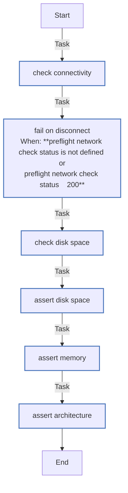

<!-- DOCSIBLE START -->

# 📃 Role overview

## preflight

Description: Pre-flight checks to ensure minimum system requirements are met.

<b>🧩 Argument Specifications in meta/argument_specs</b>

#### Key: main

**Description**: Performs pre-flight checks:
- Network connectivity to get.k3s.io
- Root partition disk space (> 20GB)
- System memory (> 4GB)
- Architecture (x86_64 only)

**Options**:

### Defaults

**These are static variables with lower priority**

#### File: defaults/main.yml

| Var          | Type         | Value       |Required    | Title       |
|--------------|--------------|-------------|------------|-------------|
| [preflight_min_ram_mb](defaults/main.yml#L8)   | int | `2048` |    false  |  Minimum RAM |
| [preflight_min_disk_gb](defaults/main.yml#L14)   | int | `20` |    false  |  Minimum Disk Space |

<b>🖇️ Full descriptions for vars in defaults/main.yml</b>

 
<table>
<th>Var</th><th>Description</th>
<tr><td><b>preflight_min_ram_mb</b></td><td>Minimum RAM required in MB.</td></tr>
<tr><td><b>preflight_min_disk_gb</b></td><td>Minimum Disk space on / required in GB.</td></tr>
</table>
 

### Tasks

#### File: tasks/main.yml

| Name | Module | Has Conditions | Comments |
| ---- | ------ | -------------- | -------- |
| [Check connectivity](tasks/main.yml#L2) | ansible.builtin.uri | False | Verify network connectivity to K3s download endpoint |
| [Fail on disconnect](tasks/main.yml#L12) | ansible.builtin.fail | True | Abort if network is unreachable |
| [Check disk space](tasks/main.yml#L17) | ansible.builtin.shell | False | Check available disk space on root filesystem |
| [Assert disk space](tasks/main.yml#L24) | ansible.builtin.assert | False | Validate disk space meets minimum requirements |
| [Assert memory](tasks/main.yml#L35) | ansible.builtin.assert | False | Validate system memory meets minimum requirements |
| [Assert architecture](tasks/main.yml#L43) | ansible.builtin.assert | False | Validate system architecture is supported |

## Task Flow Graphs

### Graph for main.yml

## Author Information
Roura

#### License

MIT

#### Minimum Ansible Version

2.20.0

#### Platforms

- **Ubuntu**: ['noble']

#### Dependencies

No dependencies specified.
<!-- DOCSIBLE END -->
