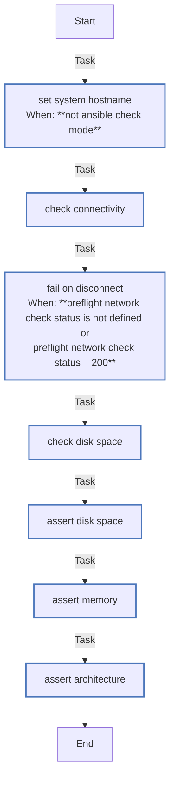

<!-- DOCSIBLE START -->

# 📃 Role overview

## preflight

Description: Pre-flight checks to ensure minimum system requirements are met.

<b> Argument Specifications in meta/argument_specs</b>

#### Key: main

**Description**: Performs pre-flight checks:
- Network connectivity to get.k3s.io
- Root partition disk space (> 20GB)
- System memory (> 4GB)
- Architecture (x86_64 only)

**Options**:

### Tasks

#### File: tasks/main.yml

| Name | Module | Has Conditions | Comments |
| ---- | ------ | -------------- | -------- |
| [Set system hostname](tasks/main.yml#L2) | ansible.builtin.hostname | True | @docsible Set system hostname |
| [Check connectivity](tasks/main.yml#L8) | ansible.builtin.uri | False | @docsible Verify network connectivity to K3s download endpoint |
| [Fail on disconnect](tasks/main.yml#L18) | ansible.builtin.fail | True | @docsible Fail if network is unreachable |
| [Check disk space](tasks/main.yml#L23) | ansible.builtin.shell | False | @docsible Check available disk space on root filesystem |
| [Assert disk space](tasks/main.yml#L30) | ansible.builtin.assert | False | @docsible Validate minimum disk space requirement |
| [Assert memory](tasks/main.yml#L41) | ansible.builtin.assert | False | @docsible Validate minimum memory requirement |
| [Assert architecture](tasks/main.yml#L49) | ansible.builtin.assert | False | @docsible Validate x86_64 architecture |

## Task Flow Graphs

### Graph for main.yml

## Author Information
Roura

### License

MIT

### Minimum Ansible Version

2.20.0

### Platforms

- **Ubuntu**: ['noble']

### Dependencies

No dependencies specified.
<!-- DOCSIBLE END -->
