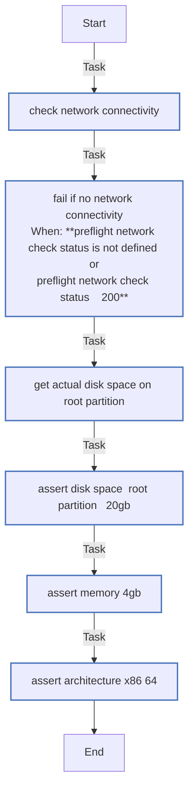

<!-- DOCSIBLE START -->

# 📃 Role overview

## preflight

Description: Verificaciones previas para asegurar requisitos mínimos del sistema

| Field                | Value           |
|--------------------- |-----------------|
| Readme update        | 2026/01/06 |

### Tasks

#### File: tasks/main.yml

| Name | Module | Has Conditions |
| ---- | ------ | -------------- |
| Check network connectivity | ansible.builtin.uri | False |
| Fail if no network connectivity | ansible.builtin.fail | True |
| Get actual disk space on root partition | ansible.builtin.shell | False |
| Assert Disk Space (Root Partition > 20GB) | ansible.builtin.assert | False |
| Assert Memory (> 4GB) | ansible.builtin.assert | False |
| Assert Architecture (x86_64) | ansible.builtin.assert | False |

## Task Flow Graphs

### Graph for main.yml

## Author Information
rc

#### License

MIT

#### Minimum Ansible Version

2.9

#### Platforms

- **Ubuntu**: ['focal', 'jammy', 'noble']

#### Dependencies

No dependencies specified.
<!-- DOCSIBLE END -->
