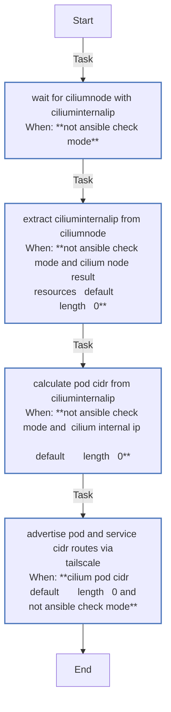

<!-- DOCSIBLE START -->

# 📃 Role overview

## tailscale

Description: Installs and configures Tailscale VPN client.

<b> Argument Specifications in meta/argument_specs</b>

#### Key: main

**Description**: Installs Tailscale, connects to the tailnet using an auth key, and configures
settings like DNS acceptance and SSH access.

**Options**:

  - **tailscale_authkey**
    - **Required**: True
    - **Type**: str
    - **Default**: none
  
    - **Description**: Tailscale authentication key (tskey-auth-...).
  
  
  

### Tasks

#### File: tasks/advertise_pod_cidr.yml

| Name | Module | Has Conditions | Comments |
| ---- | ------ | -------------- | -------- |
| [Wait for CiliumNode with CiliumInternalIP](tasks/advertise_pod_cidr.yml#L4) | kubernetes.core.k8s_info | True | @docsible Waits for CiliumNode with CiliumInternalIP assigned |
| [Extract CiliumInternalIP from CiliumNode](tasks/advertise_pod_cidr.yml#L22) | ansible.builtin.set_fact | True | @docsible Parses CiliumInternalIP to determine Pod CIDR |
| [Calculate pod CIDR from CiliumInternalIP](tasks/advertise_pod_cidr.yml#L34) | ansible.builtin.set_fact | True | @docsible Calculates /24 Pod CIDR from internal IP |
| [Advertise pod and service CIDR routes via Tailscale](tasks/advertise_pod_cidr.yml#L42) | ansible.builtin.command | True | @docsible Updates Tailscale route advertisement with Pod CIDR and Service CIDR |

#### File: tasks/main.yml

| Name | Module | Has Conditions | Comments |
| ---- | ------ | -------------- | -------- |
| [Check tailscale exists](tasks/main.yml#L2) | ansible.builtin.stat | False | @docsible Check if tailscaled binary is installed at expected path |
| [Check Tailscale status](tasks/main.yml#L9) | ansible.builtin.command | True | @docsible Get tailscale status JSON (only when binary exists) |
| [Determine Tailscale state](tasks/main.yml#L18) | ansible.builtin.set_fact | False | @docsible Parse Tailscale state: installed, daemon_running, is_authenticated |
| [Display detected state](tasks/main.yml#L45) | ansible.builtin.debug | False | @docsible Display parsed state for debugging |
| [Download Tailscale installer](tasks/main.yml#L54) | ansible.builtin.get_url | True | @docsible Download official Tailscale install script |
| [Run Tailscale installer](tasks/main.yml#L65) | ansible.builtin.command | True | @docsible Execute install script (creates /usr/sbin/tailscaled) |
| [Start tailscaled service](tasks/main.yml#L74) | ansible.builtin.systemd | True | @docsible Enable and start tailscaled systemd service |
| [Logout Tailscale (reset state if inconsistent)](tasks/main.yml#L85) | ansible.builtin.command | True | @docsible Logout if backend state is inconsistent (Running but not Online) |
| [Authenticate Tailscale](tasks/main.yml#L92) | ansible.builtin.shell | True | @docsible Authenticate with tailscale up (NO --reset to preserve routes) |
| [Configure accept-dns](tasks/main.yml#L108) | ansible.builtin.command | True | @docsible Configure DNS acceptance from admin console |
| [Configure accept-routes](tasks/main.yml#L116) | ansible.builtin.command | True | @docsible Enable route acceptance for Cilium Native Routing mesh |
| [Configure SSH](tasks/main.yml#L124) | ansible.builtin.command | True | @docsible Enable Tailscale SSH server on the node |
| [Configure exit node advertisement](tasks/main.yml#L132) | ansible.builtin.command | True | @docsible Advertise as exit node if enabled in variables |
| [Disable exit node advertisement](tasks/main.yml#L140) | ansible.builtin.command | True | @docsible Disable exit node advertisement when not enabled |
| [Unset exit node](tasks/main.yml#L149) | ansible.builtin.command | True | @docsible Unset exit node usage when not using an exit node |
| [Configure static routes](tasks/main.yml#L158) | ansible.builtin.command | True | @docsible Advertise static subnet routes from inventory |
| [Clear static routes](tasks/main.yml#L167) | ansible.builtin.command | True | @docsible Clear static routes when none defined |
| [Wait for Tailscale IP](tasks/main.yml#L176) | ansible.builtin.shell | True | @docsible Wait for valid CGNAT IP (100.x.x.x) assignment |
| [Set Tailscale IP fact](tasks/main.yml#L194) | ansible.builtin.set_fact | True | @docsible Set IP_tailscale fact for use by other roles |
| [Set mock IP fact (check mode)](tasks/main.yml#L203) | ansible.builtin.set_fact | True | @docsible Provide mock IP for check mode execution |
| [Validate connectivity](tasks/main.yml#L209) | ansible.builtin.wait_for | True | @docsible Verify SSH connectivity over Tailscale network |
| [Warn connectivity](tasks/main.yml#L221) | ansible.builtin.debug | True | @docsible Warn if Tailscale SSH is not reachable |

## Task Flow Graphs

### Graph for advertise_pod_cidr.yml

### Graph for main.yml

```mermaid
flowchart TD
Start
classDef block stroke:#3498db,stroke-width:2px;
classDef task stroke:#4b76bb,stroke-width:2px;
classDef includeTasks stroke:#16a085,stroke-width:2px;
classDef importTasks stroke:#34495e,stroke-width:2px;
classDef includeRole stroke:#2980b9,stroke-width:2px;
classDef importRole stroke:#699ba7,stroke-width:2px;
classDef includeVars stroke:#8e44ad,stroke-width:2px;
classDef rescue stroke:#665352,stroke-width:2px;

  Start-->|Task| Check_tailscale_exists0[check tailscale exists]:::task
  Check_tailscale_exists0-->|Task| Check_Tailscale_status1[check tailscale status<br>When: **tailscale binary check stat exists**]:::task
  Check_Tailscale_status1-->|Task| Determine_Tailscale_state2[determine tailscale state]:::task
  Determine_Tailscale_state2-->|Task| Display_detected_state3[display detected state]:::task
  Display_detected_state3-->|Task| Download_Tailscale_installer4[download tailscale installer<br>When: **not tailscale installed   bool and not ansible<br>check mode**]:::task
  Download_Tailscale_installer4-->|Task| Run_Tailscale_installer5[run tailscale installer<br>When: **not tailscale installed   bool and not ansible<br>check mode**]:::task
  Run_Tailscale_installer5-->|Task| Start_tailscaled_service6[start tailscaled service<br>When: **not tailscale daemon running   bool and not<br>ansible check mode**]:::task
  Start_tailscaled_service6-->|Task| Logout_Tailscale__reset_state_if_inconsistent_7[logout tailscale  reset state if inconsistent <br>When: **tailscale needs logout   bool and not ansible<br>check mode**]:::task
  Logout_Tailscale__reset_state_if_inconsistent_7-->|Task| Authenticate_Tailscale8[authenticate tailscale<br>When: **not tailscale is authenticated   bool and not<br>ansible check mode**]:::task
  Authenticate_Tailscale8-->|Task| Configure_accept_dns9[configure accept dns<br>When: **tailscale is authenticated   bool or  tailscale up<br>is succeeded   default false   and not ansible<br>check mode**]:::task
  Configure_accept_dns9-->|Task| Configure_accept_routes10[configure accept routes<br>When: **tailscale is authenticated   bool or  tailscale up<br>is succeeded   default false   and not ansible<br>check mode**]:::task
  Configure_accept_routes10-->|Task| Configure_SSH11[configure ssh<br>When: **tailscale is authenticated   bool or  tailscale up<br>is succeeded   default false   and not ansible<br>check mode**]:::task
  Configure_SSH11-->|Task| Configure_exit_node_advertisement12[configure exit node advertisement<br>When: **tailscale is authenticated   bool or  tailscale up<br>is succeeded   default false   and not ansible<br>check mode**]:::task
  Configure_exit_node_advertisement12-->|Task| Disable_exit_node_advertisement13[disable exit node advertisement<br>When: **not  tailscale exitnodeenabled   default false   <br>bool  and tailscale is authenticated   bool or <br>tailscale up is succeeded   default false   and<br>not ansible check mode**]:::task
  Disable_exit_node_advertisement13-->|Task| Unset_exit_node14[unset exit node<br>When: **not  tailscale useexitnode   default false    bool<br> and tailscale is authenticated   bool or <br>tailscale up is succeeded   default false   and<br>not ansible check mode**]:::task
  Unset_exit_node14-->|Task| Configure_static_routes15[configure static routes<br>When: **tailscale advertiseroutes   default       length  <br>0 and tailscale is authenticated   bool or <br>tailscale up is succeeded   default false   and<br>not ansible check mode**]:::task
  Configure_static_routes15-->|Task| Clear_static_routes16[clear static routes<br>When: **tailscale advertiseroutes   default       length  <br> 0 and tailscale is authenticated   bool or <br>tailscale up is succeeded   default false   and<br>not ansible check mode**]:::task
  Clear_static_routes16-->|Task| Wait_for_Tailscale_IP17[wait for tailscale ip<br>When: **not ansible check mode**]:::task
  Wait_for_Tailscale_IP17-->|Task| Set_Tailscale_IP_fact18[set tailscale ip fact<br>When: **tailscale ip cmd is not skipped and tailscale ip<br>cmd stdout is defined**]:::task
  Set_Tailscale_IP_fact18-->|Task| Set_mock_IP_fact__check_mode_19[set mock ip fact  check mode <br>When: **ansible check mode**]:::task
  Set_mock_IP_fact__check_mode_19-->|Task| Validate_connectivity20[validate connectivity<br>When: **ip tailscale is defined and ip tailscale   length <br> 0 and not ansible check mode**]:::task
  Validate_connectivity20-->|Task| Warn_connectivity21[warn connectivity<br>When: **tailscale connectivity check failed   default<br>false**]:::task
  Warn_connectivity21-->End
```

## Author Information
rc

### License

MIT

### Minimum Ansible Version

2.20.0

### Platforms

- **Ubuntu**: ['noble']

### Dependencies

No dependencies specified.
<!-- DOCSIBLE END -->
