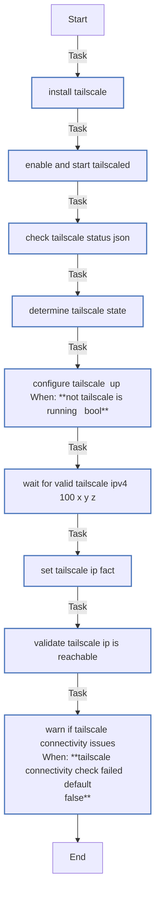

<!-- DOCSIBLE START -->

# 📃 Role overview

## tailscale

| Field                | Value           |
|--------------------- |-----------------|
| Readme update        | 2026/01/05 |

### Defaults

**These are static variables with lower priority**

#### File: defaults/main.yml

| Var          | Type         | Value       |
|--------------|--------------|-------------|
| [tailscale_hostname_prefix](defaults/main.yml#L4)   | str | `k3s` |    
| [tailscale_tags](defaults/main.yml#L5)   | str |  |    
| [tailscale_accept_dns](defaults/main.yml#L6)   | str | `true` |    
| [tailscale_ssh](defaults/main.yml#L7)   | str | `true` |    

### Tasks

#### File: tasks/main.yml

| Name | Module | Has Conditions |
| ---- | ------ | -------------- |
| Install Tailscale | ansible.builtin.shell | False |
| Enable and start tailscaled | ansible.builtin.systemd | False |
| Check Tailscale status (JSON) | ansible.builtin.command | False |
| Determine Tailscale state | ansible.builtin.set_fact | False |
| Configure Tailscale (Up) | ansible.builtin.shell | True |
| Wait for valid Tailscale IPv4 (100.x.y.z) | ansible.builtin.shell | False |
| Set tailscale_ip fact | ansible.builtin.set_fact | False |
| Validate Tailscale IP is reachable | ansible.builtin.wait_for | False |
| Warn if Tailscale connectivity issues | ansible.builtin.debug | True |

## Task Flow Graphs

### Graph for main.yml

#### Dependencies

No dependencies specified.
<!-- DOCSIBLE END -->
