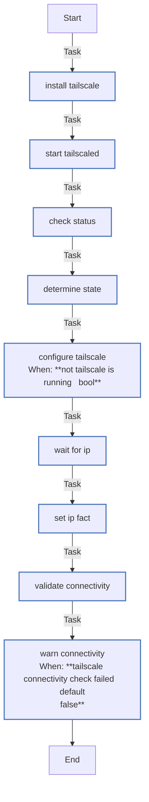

<!-- DOCSIBLE START -->

# 📃 Role overview

## tailscale

Description: Installs and configures Tailscale VPN client.

<b>🧩 Argument Specifications in meta/argument_specs</b>

#### Key: main

**Description**: Installs Tailscale, connects to the tailnet using an auth key, and configures
settings like DNS acceptance and SSH access.

**Options**:

  - **tailscale_authkey**
    - **Required**: True
    - **Type**: str
    - **Default**: none
  
    - **Description**: Tailscale authentication key (tskey-auth-...).
  
  
  

  - **tailscale_hostname_prefix**
    - **Required**: False
    - **Type**: str
    - **Default**: k3s
  
    - **Description**: Prefix for the generated Tailscale hostname (e.g., k3s-hostname).
  
  
  

  - **tailscale_tags**
    - **Required**: False
    - **Type**: str
    - **Default**: 
  
    - **Description**: Comma-separated list of ACL tags to advertise (e.g., tag:k3s).
  
  
  

  - **tailscale_accept_dns**
    - **Required**: False
    - **Type**: str
    - **Default**: true
  
    - **Description**: Whether to accept DNS configuration from the tailnet ("true"/"false").
  
      - **Choices**:
    
          - true
    
          - false
    
  
  
  

  - **tailscale_ssh**
    - **Required**: False
    - **Type**: str
    - **Default**: true
  
    - **Description**: Whether to enable Tailscale SSH ("true"/"false").
  
      - **Choices**:
    
          - true
    
          - false
    
  
  
  

### Defaults

**These are static variables with lower priority**

#### File: defaults/main.yml

| Var          | Type         | Value       |Required    | Title       |
|--------------|--------------|-------------|------------|-------------|
| [tailscale_hostname_prefix](defaults/main.yml#L6)   | str | `k3s` |    false  |  Hostname Prefix |
| [tailscale_tags](defaults/main.yml#L12)   | str |  |    false  |  ACL Tags |
| [tailscale_accept_dns](defaults/main.yml#L18)   | str | `true` |    false  |  Accept DNS |
| [tailscale_ssh](defaults/main.yml#L24)   | str | `true` |    false  |  Enable SSH |

<b>🖇️ Full descriptions for vars in defaults/main.yml</b>

 
<table>
<th>Var</th><th>Description</th>
<tr><td><b>tailscale_hostname_prefix</b></td><td>Prefix for the generated Tailscale hostname (e.g., k3s-hostname).</td></tr>
<tr><td><b>tailscale_tags</b></td><td>Comma-separated list of ACL tags to advertise (e.g., tag:k3s).</td></tr>
<tr><td><b>tailscale_accept_dns</b></td><td>Whether to accept DNS configuration from the tailnet ("true"/"false").</td></tr>
<tr><td><b>tailscale_ssh</b></td><td>Whether to enable Tailscale SSH ("true"/"false").</td></tr>
</table>
 

### Tasks

#### File: tasks/main.yml

| Name | Module | Has Conditions |
| ---- | ------ | -------------- |
| [Install Tailscale](tasks/main.yml#L2) | ansible.builtin.shell | False |
| [Start tailscaled](tasks/main.yml#L9) | ansible.builtin.systemd | False |
| [Check status](tasks/main.yml#L15) | ansible.builtin.command | False |
| [Determine state](tasks/main.yml#L22) | ansible.builtin.set_fact | False |
| [Configure Tailscale](tasks/main.yml#L32) | ansible.builtin.shell | True |
| [Wait for IP](tasks/main.yml#L49) | ansible.builtin.shell | False |
| [Set IP fact](tasks/main.yml#L63) | ansible.builtin.set_fact | False |
| [Validate connectivity](tasks/main.yml#L69) | ansible.builtin.wait_for | False |
| [Warn connectivity](tasks/main.yml#L77) | ansible.builtin.debug | True |

## Task Flow Graphs

### Graph for main.yml

## Author Information
Roura

#### License

MIT

#### Minimum Ansible Version

2.20.0

#### Platforms

- **Ubuntu**: ['noble']

#### Dependencies

No dependencies specified.
<!-- DOCSIBLE END -->
