<!-- DOCSIBLE START -->

# 📃 Role overview

## tailscale

Description: Installs and configures Tailscale VPN client.

<b> Argument Specifications in meta/argument_specs</b>

#### Key: main

**Description**: Installs Tailscale, connects to the tailnet using an auth key, and configures
settings like DNS acceptance and SSH access.

**Options**:

  - **tailscale_authkey**
    - **Required**: True
    - **Type**: str
    - **Default**: none
  
    - **Description**: Tailscale authentication key (tskey-auth-...).
  
  
  

  - **tailscale_hostnamePrefix**
    - **Required**: False
    - **Type**: str
    - **Default**: k3s
  
    - **Description**: Prefix for the generated Tailscale hostname (e.g., k3s-hostname).
  
  
  

  - **tailscale_tags**
    - **Required**: False
    - **Type**: str
    - **Default**: 
  
    - **Description**: Comma-separated list of ACL tags to advertise (e.g., tag:k3s).
  
  
  

  - **tailscale_acceptDns**
    - **Required**: False
    - **Type**: str
    - **Default**: true
  
    - **Description**: Whether to accept DNS configuration from the tailnet ("true"/"false").
  
      - **Choices**:
    
          - true
    
          - false
    
  
  
  

  - **tailscale_ssh**
    - **Required**: False
    - **Type**: str
    - **Default**: true
  
    - **Description**: Whether to enable Tailscale SSH ("true"/"false").
  
      - **Choices**:
    
          - true
    
          - false
    
  
  
  

### Tasks

#### File: tasks/main.yml

| Name | Module | Has Conditions | Comments |
| ---- | ------ | -------------- | -------- |
| [Install Tailscale](tasks/main.yml#L2) | ansible.builtin.get_url | True | @docsible Download Tailscale installation script |
| [Run Tailscale installer](tasks/main.yml#L11) | ansible.builtin.command | True | @docsible Execute Tailscale installer |
| [Start tailscaled](tasks/main.yml#L17) | ansible.builtin.systemd | True | @docsible Enable and start Tailscale daemon |
| [Check status](tasks/main.yml#L25) | ansible.builtin.command | False | @docsible Check Tailscale connection status |
| [Determine state](tasks/main.yml#L32) | ansible.builtin.set_fact | False | @docsible Parse connection state from status output |
| [Logout Tailscale (reset state)](tasks/main.yml#L53) | ansible.builtin.command | True | @docsible Logout if in stale state |
| [Configure Tailscale](tasks/main.yml#L60) | ansible.builtin.shell | True | @docsible Configure Tailscale with auth key and settings |
| [Enable exit node advertisement](tasks/main.yml#L81) | ansible.builtin.command | True | @docsible Advertise as exit node |
| [Advertise routes](tasks/main.yml#L91) | ansible.builtin.command | True | @docsible Advertise subnet routes |
| [Wait for IP](tasks/main.yml#L100) | ansible.builtin.shell | True | @docsible Wait for Tailscale IP assignment |
| [Set IP fact](tasks/main.yml#L118) | ansible.builtin.set_fact | True | @docsible Store Tailscale IP as fact |
| [Set mock IP fact (check mode)](tasks/main.yml#L125) | ansible.builtin.set_fact | True | @docsible Provide mock IP in check mode |
| [Validate connectivity](tasks/main.yml#L130) | ansible.builtin.wait_for | True | @docsible Test SSH connectivity via Tailscale |
| [Warn connectivity](tasks/main.yml#L138) | ansible.builtin.debug | True | @docsible Warn if connectivity test fails |
| [Exit node approval reminder](tasks/main.yml#L143) | ansible.builtin.debug | True | @docsible Remind about exit node approval in admin console |
| [Configure exit node](tasks/main.yml#L152) | ansible.builtin.command | True | @docsible Configure exit node routing for non-exit-node hosts |

## Task Flow Graphs

### Graph for main.yml

```mermaid
flowchart TD
Start
classDef block stroke:#3498db,stroke-width:2px;
classDef task stroke:#4b76bb,stroke-width:2px;
classDef includeTasks stroke:#16a085,stroke-width:2px;
classDef importTasks stroke:#34495e,stroke-width:2px;
classDef includeRole stroke:#2980b9,stroke-width:2px;
classDef importRole stroke:#699ba7,stroke-width:2px;
classDef includeVars stroke:#8e44ad,stroke-width:2px;
classDef rescue stroke:#665352,stroke-width:2px;

  Start-->|Task| Install_Tailscale0[install tailscale<br>When: **not ansible check mode**]:::task
  Install_Tailscale0-->|Task| Run_Tailscale_installer1[run tailscale installer<br>When: **not ansible check mode**]:::task
  Run_Tailscale_installer1-->|Task| Start_tailscaled2[start tailscaled<br>When: **not ansible check mode**]:::task
  Start_tailscaled2-->|Task| Check_status3[check status]:::task
  Check_status3-->|Task| Determine_state4[determine state]:::task
  Determine_state4-->|Task| Logout_Tailscale__reset_state_5[logout tailscale  reset state <br>When: **tailscale needs logout   bool and not ansible<br>check mode**]:::task
  Logout_Tailscale__reset_state_5-->|Task| Configure_Tailscale6[configure tailscale<br>When: **not tailscale is running   bool and not ansible<br>check mode**]:::task
  Configure_Tailscale6-->|Task| Enable_exit_node_advertisement7[enable exit node advertisement<br>When: **tailscale exitnodeenabled   bool and tailscale is<br>running   bool and not ansible check mode**]:::task
  Enable_exit_node_advertisement7-->|Task| Advertise_routes8[advertise routes<br>When: **tailscale advertiseroutes   length   0 and<br>tailscale is running   bool and not ansible check<br>mode**]:::task
  Advertise_routes8-->|Task| Wait_for_IP9[wait for ip<br>When: **tailscale status json rc    0 and not ansible<br>check mode**]:::task
  Wait_for_IP9-->|Task| Set_IP_fact10[set ip fact<br>When: **tailscale ip cmd is not skipped**]:::task
  Set_IP_fact10-->|Task| Set_mock_IP_fact__check_mode_11[set mock ip fact  check mode <br>When: **ansible check mode**]:::task
  Set_mock_IP_fact__check_mode_11-->|Task| Validate_connectivity12[validate connectivity<br>When: **ip tailscale is defined and ip tailscale   length <br> 0**]:::task
  Validate_connectivity12-->|Task| Warn_connectivity13[warn connectivity<br>When: **tailscale connectivity check failed   default<br>false**]:::task
  Warn_connectivity13-->|Task| Exit_node_approval_reminder14[exit node approval reminder<br>When: **tailscale exitnodeenabled   bool**]:::task
  Exit_node_approval_reminder14-->|Task| Configure_exit_node15[configure exit node<br>When: **groups  vps   is defined and groups  vps    <br>length   0 and not tailscale exitnodeenabled  <br>bool and tailscale is running   bool and not<br>ansible check mode**]:::task
  Configure_exit_node15-->End
```

## Author Information
Roura

### License

MIT

### Minimum Ansible Version

2.20.0

### Platforms

- **Ubuntu**: ['noble']

### Dependencies

No dependencies specified.
<!-- DOCSIBLE END -->
