<!-- DOCSIBLE START -->

# 📃 Role overview

## tailscale

Description: Installs and configures Tailscale VPN client.

<b>🧩 Argument Specifications in meta/argument_specs</b>

#### Key: main

**Description**: Installs Tailscale, connects to the tailnet using an auth key, and configures
settings like DNS acceptance and SSH access.

**Options**:

  - **tailscale_authkey**
    - **Required**: True
    - **Type**: str
    - **Default**: none
  
    - **Description**: Tailscale authentication key (tskey-auth-...).
  
  
  

  - **tailscale_hostname_prefix**
    - **Required**: False
    - **Type**: str
    - **Default**: k3s
  
    - **Description**: Prefix for the generated Tailscale hostname (e.g., k3s-hostname).
  
  
  

  - **tailscale_tags**
    - **Required**: False
    - **Type**: str
    - **Default**: 
  
    - **Description**: Comma-separated list of ACL tags to advertise (e.g., tag:k3s).
  
  
  

  - **tailscale_accept_dns**
    - **Required**: False
    - **Type**: str
    - **Default**: true
  
    - **Description**: Whether to accept DNS configuration from the tailnet ("true"/"false").
  
      - **Choices**:
    
          - true
    
          - false
    
  
  
  

  - **tailscale_ssh**
    - **Required**: False
    - **Type**: str
    - **Default**: true
  
    - **Description**: Whether to enable Tailscale SSH ("true"/"false").
  
      - **Choices**:
    
          - true
    
          - false
    
  
  
  

### Defaults

**These are static variables with lower priority**

#### File: defaults/main.yml

| Var          | Type         | Value       |Required    | Title       |
|--------------|--------------|-------------|------------|-------------|
| [tailscale_hostname_prefix](defaults/main.yml#L5)   | str | `k3s` |    false  |  Hostname Prefix |
| [tailscale_tags](defaults/main.yml#L10)   | str |  |    false  |  ACL Tags |
| [tailscale_accept_dns](defaults/main.yml#L15)   | str | `true` |    false  |  Accept DNS |
| [tailscale_ssh](defaults/main.yml#L20)   | str | `true` |    false  |  Enable SSH |
| [tailscale_install_script_checksum](defaults/main.yml#L25)   | str | `7fab06250c94a527d5f74002d9fb45ac9fc702c72f7901a959571112c75048f1` |    false  |  Tailscale install script checksum |
| [tailscale_exit_node_enabled](defaults/main.yml#L30)   | bool | `False` |    false  |  Exit Node |
| [tailscale_advertise_routes](defaults/main.yml#L35)   | str |  |    false  |  Advertise Routes |

<b>🖇️ Full descriptions for vars in defaults/main.yml</b>

 
<table>
<th>Var</th><th>Description</th>
<tr><td><b>tailscale_hostname_prefix</b></td><td>Prefix for the generated Tailscale hostname (e.g., k3s-hostname).</td></tr>
<tr><td><b>tailscale_tags</b></td><td>Comma-separated list of ACL tags to advertise (e.g., tag:k3s).</td></tr>
<tr><td><b>tailscale_accept_dns</b></td><td>Whether to accept DNS configuration from the tailnet ("true"/"false").</td></tr>
<tr><td><b>tailscale_ssh</b></td><td>Whether to enable Tailscale SSH ("true"/"false").</td></tr>
<tr><td><b>tailscale_install_script_checksum</b></td><td>SHA256 for https://tailscale.com/install.sh (pin to avoid supply-chain drift).</td></tr>
<tr><td><b>tailscale_exit_node_enabled</b></td><td>Whether to advertise this node as a Tailscale exit node.</td></tr>
<tr><td><b>tailscale_advertise_routes</b></td><td>CIDR routes to advertise to the tailnet (e.g., "10.42.0.0/16,10.43.0.0/16").</td></tr>
</table>
 

### Tasks

#### File: tasks/main.yml

| Name | Module | Has Conditions | Comments |
| ---- | ------ | -------------- | -------- |
| [Install Tailscale](tasks/main.yml#L2) | ansible.builtin.get_url | False | Download Tailscale installation script with checksum verification |
| [Run Tailscale installer](tasks/main.yml#L10) | ansible.builtin.command | False | Execute Tailscale installation script if not already installed |
| [Start tailscaled](tasks/main.yml#L15) | ansible.builtin.systemd | False | Enable and start Tailscale daemon service |
| [Check status](tasks/main.yml#L23) | ansible.builtin.command | False | Check current Tailscale connection status in JSON format
Determines if Tailscale daemon is running and connected to control plane |
| [Determine state](tasks/main.yml#L31) | ansible.builtin.set_fact | False | Determine if Tailscale is actively running and connected
Parses JSON output to check BackendState=Running indicating active connection |
| [Configure Tailscale](tasks/main.yml#L43) | ansible.builtin.shell | True | Configure Tailscale with authentication and custom settings
Runs only if not connected, ensures idempotency by checking tailscale_is_running state |
| [Enable exit node advertisement](tasks/main.yml#L64) | ansible.builtin.command | True | Configure exit node if enabled (idempotent even when already running)
Updates exit node advertisement without disrupting active connection |
| [Advertise routes](tasks/main.yml#L74) | ansible.builtin.command | True | Advertise routes if specified (idempotent even when already running)
Updates subnet routes without requiring reconnect |
| [Wait for IP](tasks/main.yml#L82) | ansible.builtin.shell | False | Wait for Tailscale to assign valid 100.x.x.x IP address |
| [Set IP fact](tasks/main.yml#L98) | ansible.builtin.set_fact | False | Store Tailscale IP address as ansible fact for other roles |
| [Validate connectivity](tasks/main.yml#L103) | ansible.builtin.wait_for | False | Test SSH connectivity through Tailscale network |
| [Warn connectivity](tasks/main.yml#L112) | ansible.builtin.debug | True | Display warning if Tailscale connectivity test fails
Non-blocking warning - connectivity may work even if initial test fails |
| [Exit node approval reminder](tasks/main.yml#L117) | ansible.builtin.debug | True | Remind user to approve exit node in admin console |

## Task Flow Graphs

### Graph for main.yml

```mermaid
flowchart TD
Start
classDef block stroke:#3498db,stroke-width:2px;
classDef task stroke:#4b76bb,stroke-width:2px;
classDef includeTasks stroke:#16a085,stroke-width:2px;
classDef importTasks stroke:#34495e,stroke-width:2px;
classDef includeRole stroke:#2980b9,stroke-width:2px;
classDef importRole stroke:#699ba7,stroke-width:2px;
classDef includeVars stroke:#8e44ad,stroke-width:2px;
classDef rescue stroke:#665352,stroke-width:2px;

  Start-->|Task| Install_Tailscale0[install tailscale]:::task
  Install_Tailscale0-->|Task| Run_Tailscale_installer1[run tailscale installer]:::task
  Run_Tailscale_installer1-->|Task| Start_tailscaled2[start tailscaled]:::task
  Start_tailscaled2-->|Task| Check_status3[check status]:::task
  Check_status3-->|Task| Determine_state4[determine state]:::task
  Determine_state4-->|Task| Configure_Tailscale5[configure tailscale<br>When: **not tailscale is running   bool**]:::task
  Configure_Tailscale5-->|Task| Enable_exit_node_advertisement6[enable exit node advertisement<br>When: **tailscale exit node enabled   bool and tailscale<br>is running   bool**]:::task
  Enable_exit_node_advertisement6-->|Task| Advertise_routes7[advertise routes<br>When: **tailscale advertise routes   length   0 and<br>tailscale is running   bool**]:::task
  Advertise_routes7-->|Task| Wait_for_IP8[wait for ip]:::task
  Wait_for_IP8-->|Task| Set_IP_fact9[set ip fact]:::task
  Set_IP_fact9-->|Task| Validate_connectivity10[validate connectivity]:::task
  Validate_connectivity10-->|Task| Warn_connectivity11[warn connectivity<br>When: **tailscale connectivity check failed   default<br>false**]:::task
  Warn_connectivity11-->|Task| Exit_node_approval_reminder12[exit node approval reminder<br>When: **tailscale exit node enabled   bool**]:::task
  Exit_node_approval_reminder12-->End
```

## Author Information
Roura

#### License

MIT

#### Minimum Ansible Version

2.20.0

#### Platforms

- **Ubuntu**: ['noble']

#### Dependencies

No dependencies specified.
<!-- DOCSIBLE END -->
