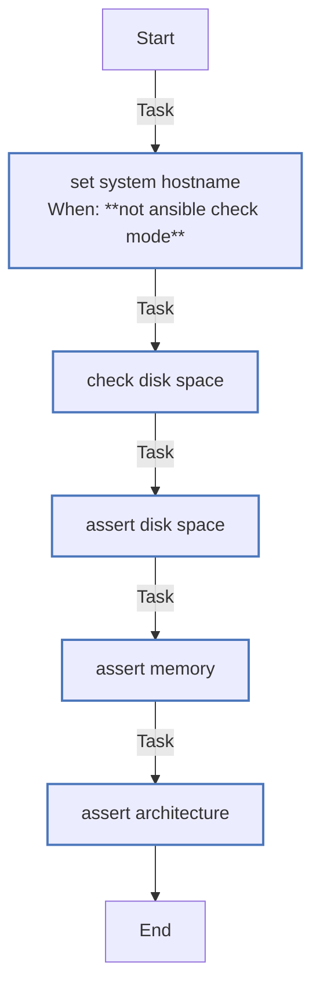

<!-- DOCSIBLE START -->

# 📃 Role overview

## validate_hardware

Description: Pre-flight checks to ensure minimum system requirements are met.

<b>🧩 Argument Specifications in meta/argument_specs</b>

#### Key: main

**Description**: Performs pre-flight checks:
- Network connectivity to get.k3s.io
- Root partition disk space (> 20GB)
- System memory (> 4GB)
- Architecture (x86_64 only)

**Options**:

### Tasks

#### File: tasks/main.yml

| Name | Module | Has Conditions | Comments |
| ---- | ------ | -------------- | -------- |
| [Set system hostname](tasks/main.yml#L2) | ansible.builtin.hostname | True | @docsible Sets persistent system hostname to match inventory |
| [Check disk space](tasks/main.yml#L8) | ansible.builtin.shell | False | @docsible Retrieves available space on root filesystem (KB) |
| [Assert disk space](tasks/main.yml#L16) | ansible.builtin.assert | False | @docsible Enforces minimum disk space requirement (Default: 20GB) |
| [Assert memory](tasks/main.yml#L28) | ansible.builtin.assert | False | @docsible Enforces minimum RAM requirement (Default: 2GB) |
| [Assert architecture](tasks/main.yml#L37) | ansible.builtin.assert | False | @docsible Enforces x86_64 CPU architecture |

## Task Flow Graphs

### Graph for main.yml

## Author Information
rc

#### License

MIT

#### Minimum Ansible Version

2.20.0

#### Platforms

- **Ubuntu**: ['noble']

#### Dependencies

No dependencies specified.
<!-- DOCSIBLE END -->
