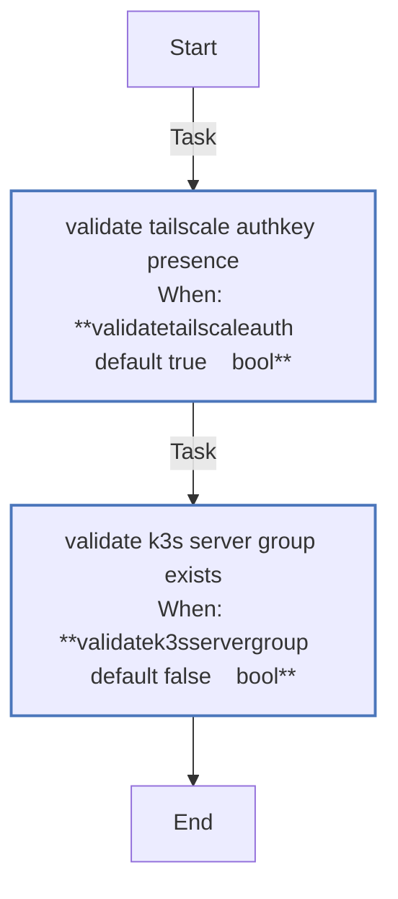

<!-- DOCSIBLE START -->

# 📃 Role overview

## validate_secrets

Description: Shared pre-flight validation role for hardware and system readiness checks.

### Tasks

#### File: tasks/main.yml

| Name | Module | Has Conditions | Comments |
| ---- | ------ | -------------- | -------- |
| [Validate Tailscale AuthKey presence](tasks/main.yml#L4) | ansible.builtin.assert | True | @docsible Asserts tailscale_authkey is defined and not a placeholder value |
| [Validate k3s_server group exists](tasks/main.yml#L16) | ansible.builtin.assert | True | @docsible Ensures k3s_server inventory group exists when required |

## Task Flow Graphs

### Graph for main.yml

## Author Information
rc

#### License

MIT

#### Minimum Ansible Version

2.20.0

#### Platforms

- **Ubuntu**: ['noble']

#### Dependencies

No dependencies specified.
<!-- DOCSIBLE END -->
